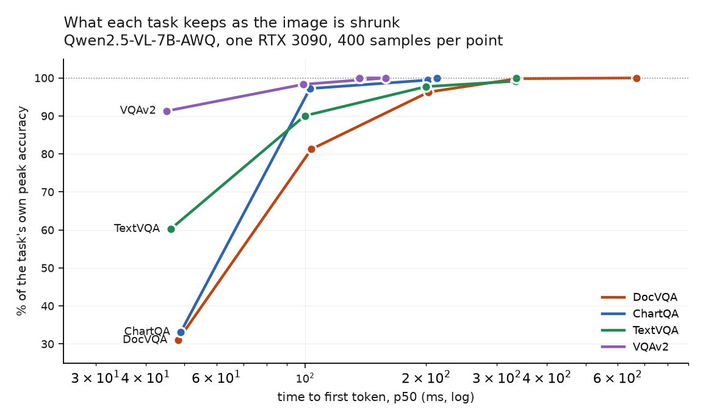

# VLM Inference Optimization

Measured answers to: **what does a vision-language model actually cost to serve, and
what does making it cheaper cost you in accuracy?**

**Full write-up: [sadbodhs.github.io/vlm_inference_optimization](https://sadbodhs.github.io/vlm_inference_optimization/)** — including [the measurement bugs that produced wrong numbers](https://sadbodhs.github.io/vlm_inference_optimization/corrections/) and [what these numbers do not support](https://sadbodhs.github.io/vlm_inference_optimization/not-measured/).

Single RTX 3090, 24 GB, sm_86. Sibling study to
[computer_vision_optimization](https://github.com/sadbodhs/computer_vision_optimization),
which asked the same kind of question about YOLO serving stacks.

Status: **first results measured.** One model, one arm, one dataset — see
[the results site](https://sadbodhs.github.io/vlm_inference_optimization/) for the numbers and what they do not cover.

## Headline

| | |
|---|---|
| Decode is near the physical limit | **149.1 tok/s = 88.7%** of the 936 GB/s roofline |
| A vision token costs | **0.32 ms** of TTFT, over a 17.3 ms floor (R² = 0.9995) |
| Accuracy saturates at ~1,000 vision tokens | beyond that, **+284% TTFT for +0.012 ANLS** |
| Synthetic images overstate capacity | by **6.4×** vs real document pages |
| Caching is a workload property | **3×** on repeated inputs, **1.00×** on distinct ones |
| Live video: 8 RTSP streams | at 1 fps each, 98% of answers inside a 2 s freshness budget |
| Past that knee | throughput **rises 70%** while freshness drops to **zero** — answers describe 26-second-old frames |
| Cheap accuracy trade | **74% faster TTFT** for 1.2 ANLS points (n=500) |
| Throughput lies after saturation | on real pages: raw ceiling **1.56 req/s**, usable **0.45 req/s** — a 3.5× overstatement |
| A detector gate beats the serving layer | YOLO → VLM cascade, both on one 3090, live: **5 → 8 cameras** (10 with ROI crops + TensorRT YOLO), 97–99% of activities kept |
| The 3090 is power-limited | 349.2 W of 350 W at 66 °C — capped, not thermally throttled |



*Shrinking the image cuts latency for every task; what it costs depends on what the
question needs to see.* At ~100 vision tokens, VQAv2 (objects, no text) keeps 91%
of its peak accuracy and DocVQA keeps 31%.

---

## Why this is a different problem from CV serving

The YOLO study had one bottleneck axis and constant quality. A VLM breaks that:

1. **Two engines with opposite needs.** A vision encoder (compute-bound, fixed cost)
   feeding an autoregressive LLM (prefill compute-bound, decode *bandwidth*-bound).
2. **Input size is a free variable.** An image is not one frame, it is *N tokens*, and
   N is a policy choice — resolution, tiling, pruning. Nothing in the CV study had
   this knob.
3. **Quality is a dependent variable.** Every token-reduction and quantization trick
   trades accuracy, so the deliverable is a **latency × accuracy frontier**, not a
   ranking.

## The experiments

| | Question | Status |
|---|---|---|
| **E0** saturation | At what arrival rate does this arm stop keeping up — and was the *client* the real bottleneck? | measured |
| **E1** roofline | Does single-stream decode land where 936 GB/s says it must? | measured |
| **E2** TTFT vs vision tokens | What does one vision token cost, and what is the fixed floor underneath it? | measured |
| **E3** token budget | How far can the budget fall before accuracy does — and does the limit depend on the task? | measured on DocVQA only |
| **E4** live RTSP | How many camera streams can one 3090 understand, and how stale is the answer? | measured (pipeline only, no accuracy) |

**Execution order is E1 → E2 → E0 → E3**, which is not the numeric order.

The numbers say what each experiment is prerequisite *for*; the order says what has
to be true before the next measurement means anything.

- **E1 first** because it validates the instrument. A decode rate above the
  memory-bandwidth ceiling is physically impossible, so it can only mean the harness
  is wrong. If E1 fails, the runner refuses to run anything else — every later number
  assumes the harness is honest.
- **E2 second**: concurrency 1, so the TTFT-vs-tokens curve is measured with no
  queueing mixed into it.
- **E0 third**. It is numbered zero because it is the prerequisite for any
  *throughput* claim — "saturate before you measure" — not because it runs first.
- **E3 last**: the expensive one, and the only one needing a dataset.

## The 3090 sets the questions

Decode reads every weight once per token, so at 936 GB/s the ceiling is fixed before
any software choice:

| Config | Weights | Decode ceiling | KV room at 0.9 util |
|---|---|---|---|
| 7B FP16 | ~16.5 GB | ~55 tok/s | ~5 GB (~90 K tokens) |
| 7B AWQ | ~6 GB | ~155 tok/s | ~15 GB (~270 K tokens) |
| 3B FP16 | ~7.5 GB | ~125 tok/s | ~14 GB (~380 K tokens) |

At ~1,500 vision tokens for a document page that is **~60 concurrent requests at FP16
versus ~175 at AWQ**. On this card quantization is primarily a *batching*
optimization, not a latency one. E0 and E1 exist to test that claim.

No FP8 on sm_86 — that arm is out of scope here rather than faked.

## Run it

Everything runs in Docker — harness included. No host Python, no venv, no conda.

```bash
docker build -f docker/harness.Dockerfile -t vlmbench-harness .
./scripts/smoke.sh        # all four experiments against a mock server, no GPU
```

Against a real server on the 3090:

```bash
docker/run_vllm.sh start arms/B_vllm_awq.yaml       # first run downloads weights
docker/run_harness.sh python3 experiments/e0_saturation.py     --arm arms/B_vllm_awq.yaml
docker/run_harness.sh python3 experiments/e1_roofline.py       --arm arms/B_vllm_awq.yaml
docker/run_harness.sh python3 experiments/e2_ttft_vs_tokens.py --arm arms/B_vllm_awq.yaml
docker/run_harness.sh python3 experiments/e3_token_budget.py   --arm arms/B_vllm_awq.yaml \
    --manifest data/docvqa/manifest.jsonl --scorer anls
docker/run_harness.sh python3 experiments/plot.py
docker/run_vllm.sh stop
```

Server and harness sit on a shared `vlmbench` Docker network and address each other
by container name, so the measurement code is byte-identical across arms (R1). The
resolved image digest of both is written into every `meta.json`.

The harness container is CPU-only and requests `--gpus all` for exactly one reason:
the NVIDIA runtime injects `nvidia-smi`, without which every run silently records
null clocks and the thermal check stops working.

## How the harness holds the bar

The [four rules](https://sadbodhs.github.io/) are enforced in code, not in prose.

- **R1 — one variable at a time.** Every stack is driven through one
  OpenAI-compatible streaming path. An arm is a YAML file; adding one never adds a
  branch.
- **R2 — saturate before you measure.** Every run self-reports `saturated`,
  `not-saturated`, or `client-bound`. The third is the one nobody checks: if the load
  generator falls behind schedule, the throughput number describes the harness. It is
  detected by tracking per-request scheduling lag, and such runs are discarded rather
  than reported. Saturation itself is judged on *queue growth* — Poisson arrival
  variance at small n is ±18%, enough to fake a saturation signal on its own.
- **R3 — publish the cost.** Accuracy is scored from the same generated outputs as
  the latency run, so a frontier point is never assembled from two experiments.
- **R4 — say what was not measured.** Every run writes `not_measured` into
  `meta.json`.

Thermal state is recorded before and after every run, since a 350 W card throttling
across a long sweep produces drift that reads exactly like an effect.

## Layout

```
bench/          harness: client, load generators, metrics, scorers
experiments/    E0-E3 + plotting
arms/           one YAML per configuration; arms are data, not code
tools/          mock VLM server for GPU-free dry runs
data/           frozen eval subsets + manifests
results/        raw jsonl, summaries, meta
docs/           write-ups
PLAN.md         full project plan
```

## Not measured yet

One model, one arm, one dataset, one run per point — so nothing here separates "how
VLM serving behaves" from "how this checkpoint behaves on this card". Full list in
[not measured](https://sadbodhs.github.io/vlm_inference_optimization/not-measured/). Still open: the 3B and FP16 controls;
ChartQA and natural-image sets (frozen, unrun); prefix caching measured as an
optimisation rather than as a confound; whether CPU-side image preprocessing outweighs
the vision encoder in TTFT; a disaggregated encoder service and its embedding-transport
hop; video and multi-image; and anything requiring FP8.
