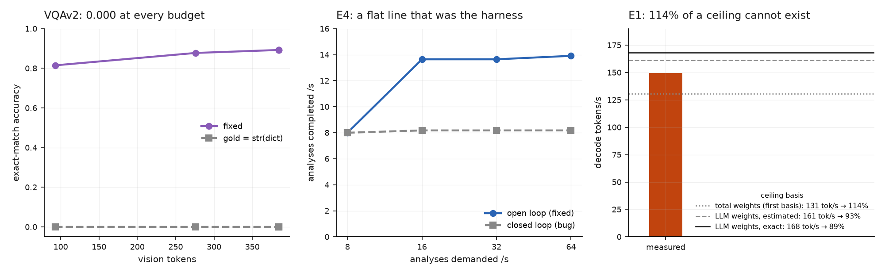

# Corrections

Ten measurement bugs found while building this, and one conclusion that went
further than its data. Four of the bugs produced
**publishable-looking numbers that were wrong**. None were caught by inspection —
every one was caught by a physical bound, a cross-experiment contradiction, or an
internal inconsistency in the data.

This page exists because the corrections are more useful than the numbers.

*What three of these bugs looked like.* Each one produced a clean, plausible
shape; none raised an error. Left: VQAv2 scored against serialised dicts. Middle:
a closed-loop harness reporting its own pacing as capacity. Right: a decode rate
above the ceiling it was measured against.

## The three that would have been published

### The caching result, wrong by 8×

E0 cycled a 32-document pool, so with caching on nearly every request was a hit.
The defaults arm looked **8× faster** than the clean arm — a spectacular result,
and a measurement of a ~100% input-reuse workload that almost nobody has.

E3 said caching bought nothing on distinct inputs. E0 said 8×. Both could not be
true, **and the contradiction is what exposed it**.

Fixing it left all five rates sharing one 80-document pool, so only the first rate
was cold — visible as the two arms agreeing to within **3 ms at 0.5 QPS** while
every later rate was 13× apart.

### "Accuracy collapses at every resolution"

E3 first scored 0.018–0.030 ANLS, flat across every token budget. Read naively:
*resolution does not matter for DocVQA* — a headline result, and completely wrong.

The model was reading the documents nearly perfectly and answering in sentences:

> gold `['100001']` → pred `'The invoice number is 100001.'` → ANLS **0.00**

**92 of 100 predictions contained the gold answer.** DocVQA scores a bare span, so
the fix was one line of prompt. `tools/inspect_outputs.py` now reports how often
the gold answer appears *inside* a longer prediction, so a formatting failure can
never again be mistaken for a model failure.

### "Past the peak, more pixels are strictly worse"

At n=100 the E3 curve was non-monotonic and appeared to peak then decline. The
−0.007 ANLS that suggested it sat inside a 95% CI of [−0.013, +0.033]. At n=500 the
curve is cleanly monotonic — the decline was sampling noise.

## The three that killed a run silently

### A `grep` ended a two-hour study

`EXTRA=$(grep -E '^server_args:' "$ARM" | ...)` — grep exits 1 when the field is
absent, `pipefail` propagates it, `set -e` kills the script. The clean arm defines
`server_args` so it survived; the defaults arm does not, so the study aborted the
moment it reached it, with **no error in the log**.

### A `pgrep` that matched itself

The liveness check was `pgrep -f run_full_study` — run over SSH, in a command
string that *contains* `run_full_study`. It matched itself and reported the study
alive for **2h21m** after it had died.

### A harness that reported its own pacing as capacity

E4's tick loop awaited every analysis before starting the next, pinning concurrency
at the stream count. It produced a flat **8.18 analyses/s across an 8× range of
demand** — which reads as clean saturation and is really 8 requests at ~980 ms
each. `bench/loadgen.py` warns about exactly this; E4 was written with the flaw the
harness was built to avoid.

## The one that was a modelling error, not a code bug

The roofline first used the **total** 7.16 GB weight footprint. Decode re-reads only
the LLM weights — the bf16 vision tower runs once in prefill — so the real basis is
5.81 GB. Against the wrong basis, the measured 149.4 tok/s read as **114% of
roofline**: impossible. The gate fired correctly, on a wrong model rather than
wrong code.

## The hypothesis that was tested and failed

The SGLang accuracy gap grew with vision-token count, which is the signature of
numerical divergence accumulating in the vision tower — and SGLang defaults to a
different vision attention kernel than vLLM. A clean mechanism, fitting the data.

Pinning both stacks to the same backend changed the gap by 0.002. The mechanism
was wrong.

It is on this page because a plausible story that fits the data is not evidence,
and the only thing separating this from the four entries above is that it was
tested before being published.

## The one that was too wrong to believe

The first VQAv2 run scored **exactly 0.000 at all five budgets**. A 7B VLM scores
around 0.8 on VQAv2, so zero is not a weak result — it is a broken pipeline, and
a physical bound in the same sense as a decode rate above the roofline.

VQAv2 stores each annotator's answer as a dict. `tools/build_manifest.py` called
`str()` on every list element, which is right for TextVQA's plain strings and wrong
here — every gold answer became

> `"{'answer': 'double decker', 'answer_confidence': 'maybe', 'answer_id': 4}"`

which no prediction can equal. The model was never evaluated at all. The builder
now unwraps answer dicts and **refuses to write a manifest** whose golds look like
serialised containers, because scoring against one yields a clean 0.0, not an error.

A subtler version — a dataset where only *some* answers were dicts — would have
produced a depressed but plausible score, and would have passed every check here
except that guard.

## The parser that emptied the corpus

E7 needed MEVA's *exhaustive* activity labels, because a cascade's cost is the
activities it skips. The indexer read the annotation files, reported 274 of 769
clips as having no activity at all, and the median clip as active 9% of the time.
Both numbers went into the pre-registration.

MEVA writes its annotations in **two layouts** — `{'act': {...}}` and
`{ act: {...} }` — and the indexer filtered on the first. It skipped 266 clips
without a warning, and they indexed as empty. It also counted the annotators'
whole-clip "none of the 37 activities" marker as a five-minute activity. The
corrected corpus has **53** empty clips and a median of **26%**. The first clip
selection had built its "empty" bin from busy cameras, so the first gate analysis
was void.

What exposed it was a *second* parser with the same blind spot: the detector-recall
table came out entirely blank. The parsers now refuse any file whose annotation
lines do not all parse, and PLAN.md carries a dated amendment rather than a silent
rewrite.

## The best result was the one where 43% of requests crashed

The vLLM-vs-SGLang page reported SGLang's usable goodput as **0.55 req/s, 22%
above vLLM**. It was the highest SGLang value in its E0 sweep — at 2.0 req/s,
where **34 of 80 requests had returned HTTP 500**.

The harness computed latency percentiles and goodput over the requests that
succeeded, and raised an error only if *every* request failed. So failures did
not merely go unreported; they *improved* the numbers: the slow requests are the
ones that crash under memory pressure, and removing them from the denominator of
a latency distribution leaves a faster one. Every column at that rate moved the
wrong way at once — fewer completions than the lower rate, a lower p99, higher
goodput — and nothing flagged it.

It surfaced while plotting all arms' E0 curves together for the first time: a
point that bends back is visible on a chart and invisible in a table. An audit of
every run in the study found failures in exactly three, all SGLang E0 rates. The
corrected figure is 0.35 req/s, 22% *below* vLLM, and SGLang's saturated capacity
is recorded as not measured. The harness now records the failed fraction of every
run and disqualifies any rate over 1%.

## The conclusion that generalised from one model

E7 found Qwen2.5-VL-7B recognising conversations *below* chance, heard it say
"no one is talking" about a crowd with sixteen annotated conversations, and wrote
that hand-scale activities were **invisible** at surveillance distance: "the
feature-size rule again". One model, read as a property of the task.

[E7d](e7d-models.md) ran seven more models on the same frames, prompt and pixels.
Qwen3-VL-8B recognises those conversations at **+34 points** above chance, and
Qwen3.5-9B at +28. The limit was the 7B's. The E7 page now carries the revision;
phones do stay hard for every model tested.

The same experiment nearly published another single-run artefact: Qwen3-VL-8B's
first live sweep read **5 cameras**, because the first runs after a server start
failed on detection latency. A warmed-up rerun read 10. Both are on the page.

## The pattern

Every one of these **reported plausible success while doing something other than
what it claimed**. That is the failure mode a benchmark harness has to be designed
against, because it is invisible to code review and indistinguishable from a
result.

The three mechanisms that actually caught them:

1. **Physical bounds** — a decode rate above the memory-bandwidth roofline cannot exist
2. **Cross-experiment contradiction** — E3 and E0 disagreeing about caching by 8×
3. **Internal consistency** — a cold rate matching the no-cache arm to within 3 ms

None of these require a profiler, and none of them are in the code being tested.
