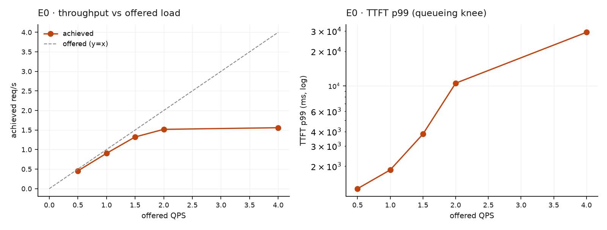
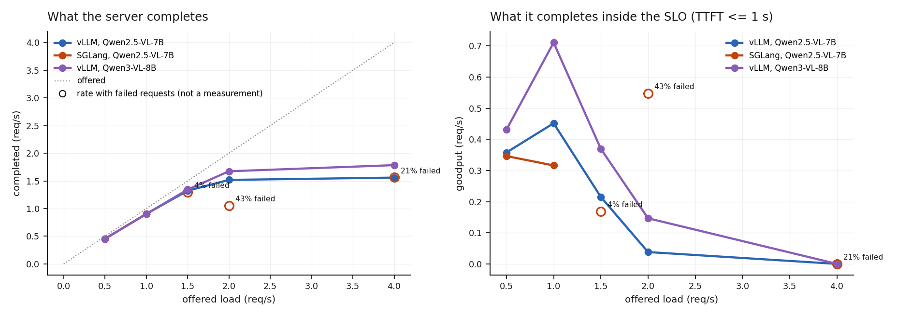

# E0 · Capacity, and why throughput lies

**Question:** at what arrival rate does this arm stop keeping up — and was the
*client* the real bottleneck?

400 distinct DocVQA pages, one per request, a **disjoint slice per rate** — zero
input reuse. SLO: TTFT ≤ 1 s, TPOT ≤ 50 ms.

## Result

| offered | achieved | goodput @ SLO | TTFT p50 | TTFT p99 | verdict |
|---|---|---|---|---|---|
| 0.5 | 0.45 | 0.36 | 668 ms | 1,275 ms | not-saturated |
| 1.0 | 0.90 | **0.45** | 744 ms | 1,856 ms | not-saturated |
| 1.5 | 1.32 | 0.21 | 1,576 ms | 3,805 ms | saturated |
| 2.0 | 1.52 | 0.04 | 4,157 ms | 10,552 ms | saturated |
| 4.0 | **1.56** | **0.00** | 14,635 ms | 29,243 ms | saturated |

Rerun on 23 September; it reproduces the committed per-rate data to within ~2% on
every latency. An earlier version of this table came from a run whose data was
never committed — its 0.5 QPS p99 of 4,085 ms appears in no result file — so it
was replaced rather than defended.

{ width="620" }

**Raw ceiling 1.56 req/s. Usable capacity 0.45 req/s.** Reporting the raw number
overstates what the server can deliver under SLO by **3.5×** — throughput keeps
reading 1.56 req/s while every request on it is 14 seconds late.

*Left, what each server completes; right, what it completes inside the SLO. The
hollow SGLang points are rates at which requests failed — they are not measurements
and are drawn so that they cannot be mistaken for one.*

## Synthetic images overstate capacity by 6×

The same experiment on synthetic 448×448 squares gives a **9.96 req/s** ceiling.
Those carry ~256 vision tokens; a DocVQA page carries ~2,000, and prefill is what
saturates this server.

An image benchmark that does not use the real document size is measuring a workload
nobody runs — here by a factor of **6.4**.

## Caching buys nothing when inputs do not repeat

Same sweep, both arms, zero reuse — achieved throughput ratio (defaults ÷ clean)
is 1.00× at every rate, and both saturate at 1.56 req/s.

!!! danger "Getting here took three corrections"
    A 32-document pool cycled across requests made the defaults arm look **8×
    faster**. Fixing that left all five rates sharing one 80-document pool, so only
    the first rate was cold — visible as the two arms agreeing to within **3 ms at
    0.5 QPS** while every later rate was 13× apart.

    Reuse is now a variable the experiment sets and records, not a side effect of
    sweep order.

!!! note "This is a verbose-output workload"
    E0 does not apply E3's "answer using a single word or phrase" instruction, so
    the model generates full sentences out to `max_tokens=64`. Consistent across
    arms, so comparisons hold — but the absolute number does not transfer to
    short-span extraction, which would see higher capacity.
