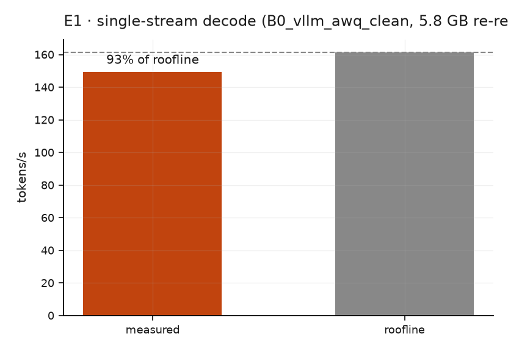
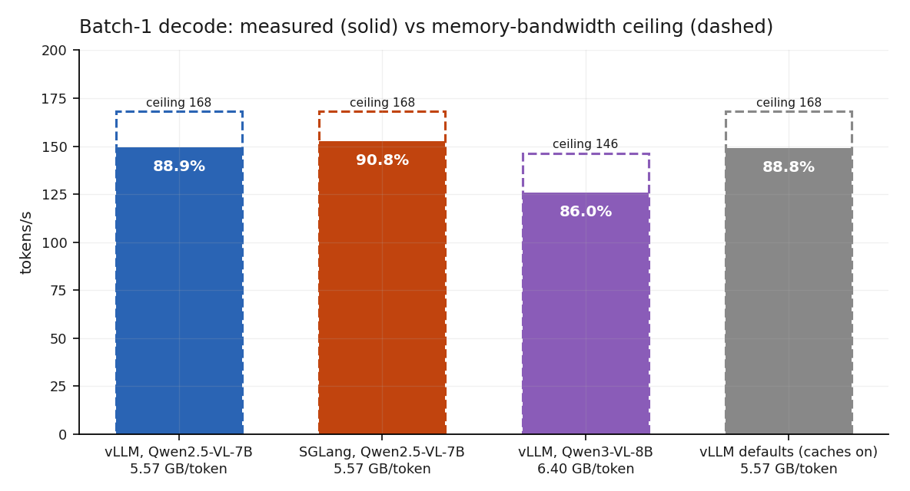

# E1 · Decode is already at the physical limit

**Question:** does single-stream decode land where 936 GB/s says it must?

E1 runs first in every sweep because it validates the instrument. Decode re-reads
the weights once per token, so bandwidth ÷ weight bytes is a hard ceiling. A
measured rate *above* it is physically impossible — it can only mean the harness is
wrong. If E1 fails that check, the runner refuses to run anything else.

## Result

| arm | measured | roofline | % of ceiling |
|---|---|---|---|
| vLLM (clean) | **149.05 ± 0.08** tok/s | 168.0 | **88.7%** |
| SGLang (clean) | **152.62 ± 0.07** tok/s | 168.0 | **90.8%** |

The ceiling is `936 GB/s ÷ 5.571 GB`, where 5.571 GB is the **exact** sum of the
LLM tensors from the safetensors headers (`tools/weight_split.py`) — not the
6.67 GiB vLLM reports as its loaded footprint, which includes allocator padding.

{ width="520" }

The figure is a **rerun on 23 September**, after a reboot and a day apart from the
table's paired runs: **149.36 ± 0.09 tok/s, 88.9%** of the ceiling — within 0.2% of
the original. (The table keeps the original vLLM run because its comparison with
SGLang was measured back-to-back.)

Three independent runs per arm; run-to-run spread is **0.11–0.14%**, which is what
lets a 2.4% difference between stacks be called real rather than noise.

{ width="640" }

*Every arm against its own ceiling, computed from the exact decode-weight bytes in
its arm file. Qwen3-VL-8B re-reads 6.40 GB per token, so its ceiling is lower and
it sits further below it.*

## There is little left to win at batch 1

At 88.7% of the ceiling, no kernel, scheduler or quantisation change can buy more
than 11.3% — and SGLang has already taken a fifth of it. Every remaining
opportunity on this card is in batching or in prefill, not in decode.

!!! danger "The roofline must exclude the vision tower"
    Decode re-reads only the **LLM** weights. The 675M-parameter bf16 vision tower
    runs once during prefill and is never touched again while tokens stream.

    Counting it gives 7.16 GB and a 131 tok/s ceiling, against which the measured
    149.4 tok/s reads as **114% — impossible**. The gate would have fired on a
    modelling error and sent us hunting a code bug that does not exist.

    Arms carry `decode_weight_bytes` separately, taken from the server's own load
    report rather than estimated.

!!! warning "This page previously said 92.5%"
    The roofline basis was **estimated** as 5.807 GB by subtracting an assumed
    vision-tower size from the server's reported footprint. Summing the
    safetensors headers exactly gives **5.571 GB**, so the ceiling is 168.0 tok/s
    rather than 161.2, and the measured rates are 88.7% / 90.8% rather than
    92.5% / 94.7%.

    The measurements never changed — only the ceiling they are divided by. The
    headroom claim moves from 7.5% to 11.3%, which makes "nothing left to win"
    a weaker statement than first published.
