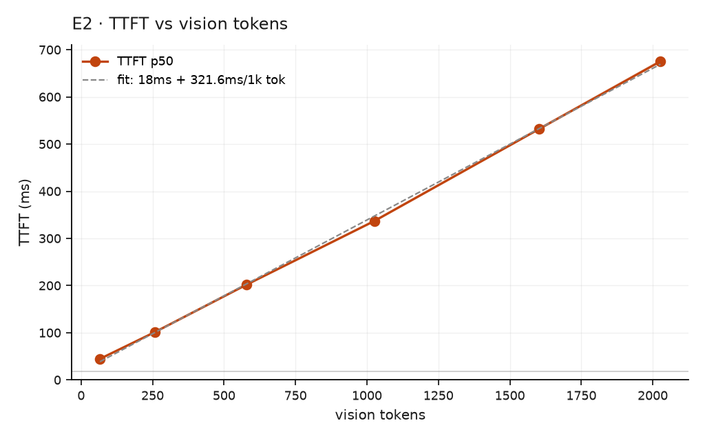

# E2 · What a vision token costs

**Question:** what does one vision token cost in time-to-first-token, and what is
the fixed floor underneath it?

Measured at concurrency 1 across 66 → 2,027 vision tokens, so nothing hides inside
queueing delay. Vision-token count is derived by **subtraction** against a
text-only control, because no serving stack reports it directly.

## The law

```
vLLM    TTFT = 17.3 ms + 325 ms per 1,000 vision tokens     (R² = 0.9995)
SGLang  TTFT =  4.5 ms + 354 ms per 1,000 vision tokens     (R² = 0.9987)
```

{ width="560" }

Two consequences:

**0.32 ms per vision token** is the exchange rate between image resolution and
time-to-first-token.

**A ~17 ms floor** no token reduction can ever recover. At document resolution it
is 2.6% of TTFT — so at the resolutions that matter, TTFT *is* vision tokens and
almost nothing else.

## The law generalises off its own training ground

Fitted on synthetic squares, it predicts a 328-token video frame costs 5.4× less
than a 2,000-token DocVQA page. Measured capacity on live RTSP versus real
documents: **5.1×**.

Three independent experiments — synthetic images, real documents, live video —
agreeing within 6%. That makes vision-token count enough to size a deployment:
halve the resolution, double the streams, without re-benchmarking.

!!! note "Where it is weaker"
    The fit under-predicts real documents by 6–18%. Synthetic images of equal token
    count are cheaper than real ones and the cause is unexplained.
