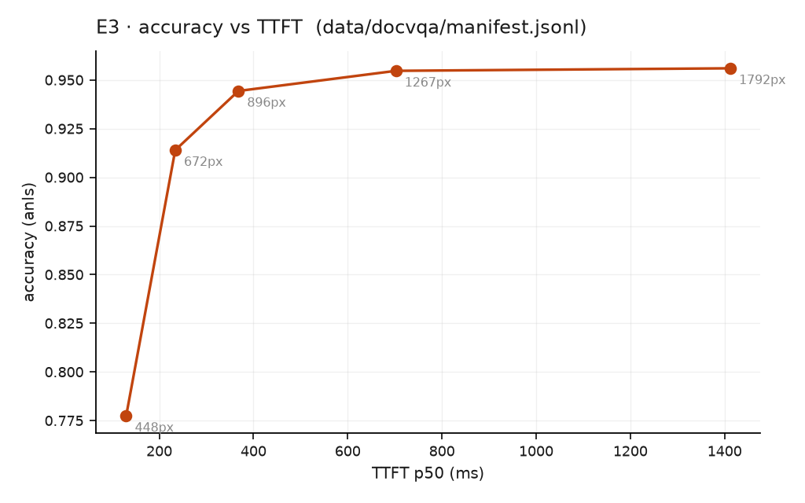

# E3 · The accuracy frontier

**Question:** how far can the token budget fall before accuracy does?

DocVQA, 500 scored samples, ANLS. The token budget is applied **client-side**,
mirroring Qwen2-VL's own `smart_resize`, so the budget exists identically on every
stack and the server's preprocessing policy is not a hidden variable.

## The frontier

| max_pixels | prompt tokens | TTFT p50 | ANLS |
|---|---|---|---|
| 200,704 | 287 | 130 ms | 0.783 |
| 451,584 | 599 | 203 ms | 0.918 |
| **802,816** | **1,032** | **339 ms** | **0.944** |
| 1,605,632 | 1,994 | 669 ms | 0.956 |
| 3,211,264 | 3,810 | 1,386 ms | 0.950 |

{ width="560" }

Peak ANLS is consistent with Qwen2.5-VL-7B's published DocVQA score. That is the
calibration check: the harness agrees with a known external value, not only with
itself.

## What n=500 supports

Bootstrapped **paired** differences (same documents at both budgets, 10k resamples):

| A | B | Δ | 95% CI | |
|---|---|---|---|---|
| 200,704 | 451,584 | −0.129 | [−0.161, −0.098] | **different** |
| 451,584 | 802,816 | −0.036 | [−0.055, −0.017] | **different** |
| 802,816 | 3,211,264 | +0.011 | [−0.002, +0.024] | indistinguishable |

**Accuracy saturates at ~1,000 vision tokens.** Below that it falls off measurably;
above it, four times the budget buys nothing detectable while costing **+284% TTFT**.

The practical operating point is 802,816 px: **0.944 ANLS at 339 ms**, versus 1,386 ms
for +0.012 ANLS that is inside the noise.

!!! warning "An earlier version of this page was wrong"
    At n=100 the curve was non-monotonic and appeared to peak then decline, which
    read as "past the peak, more pixels are strictly worse". The −0.007 that
    suggested it sat inside [−0.013, +0.033]. At n=500 the curve is cleanly
    monotonic. Resolving the top of a frontier needs n≈500, not 100.
