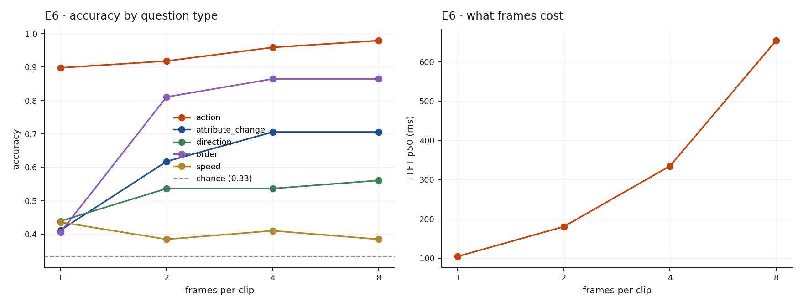

# E6 · The temporal budget frontier

**Question:** how many frames do you actually need, and what does each one cost?

E3 asked how many vision tokens one image needs. A clip costs
**frames × tokens-per-frame**, and a fixed context makes those compete: at ~1,000
tokens per frame, 8,192 tokens of context buys eight frames and nothing else.

TempCompass splits questions by what they require — `action` is largely
appearance, while `direction`, `speed`, `order` and `attribute_change` need motion
or comparison. Same clips, same format, same scorer; only the question type varies.
200 clips, ~40 per dimension, 3 options each so **chance is 0.333**.

## Result

| frames | prompt tokens | TTFT p50 | overall | action | order | attr_change | direction | speed |
|---|---|---|---|---|---|---|---|---|
| 1 | 308 | 104 ms | 0.54 | **0.90** | 0.41 | 0.41 | 0.44 | 0.44 |
| 2 | 556 | 180 ms | 0.67 | 0.92 | 0.81 | 0.62 | 0.54 | 0.38 |
| 4 | 1,050 | 335 ms | 0.70 | 0.96 | 0.86 | 0.71 | 0.54 | 0.41 |
| 8 | 2,039 | 655 ms | 0.71 | 0.98 | 0.87 | 0.71 | 0.56 | 0.38 |

{ width="720" }

Bootstrapped paired differences, 1 → 8 frames (same clips at both counts):

| dimension | n | Δ | 95% CI | |
|---|---|---|---|---|
| `order` | 37 | **+0.459** | [+0.27, +0.65] | **different** |
| `attribute_change` | 34 | **+0.294** | [+0.12, +0.47] | **different** |
| `direction` | 41 | +0.122 | [+0.02, +0.22] | different |
| `action` | 49 | +0.082 | [+0.00, +0.18] | indistinguishable |
| `speed` | 39 | −0.051 | [−0.21, +0.10] | indistinguishable |

## One frame already answers "what is happening"

`action` scores **0.898 from a single frame** and gains nothing measurable from
eight. It is an appearance question wearing a video costume — which is exactly why
action-recognition benchmarks flatter single-frame models, and why measuring
"video understanding" on them measures image classification.

## Ordering is what frames buy

`order` runs from **0.405 — indistinguishable from chance — to 0.865**. That is the
single largest effect in this study. `attribute_change` behaves the same way
(+0.294): both require comparing one moment against another, which one frame
cannot do by construction.

## Speed is at chance, and more frames do not help

| frames | 1 | 2 | 4 | 8 |
|---|---|---|---|---|
| `speed` | 0.436 | 0.385 | 0.410 | 0.385 |

At eight frames the CI is **[0.23, 0.54]**, which contains chance. The model cannot
judge speed from sampled frames *at all*, and sampling more of them does not help.

The reason is mechanical: **uniform sampling discards the timing.** Eight frames
spread evenly across a fast clip and a slow clip look the same — the information
that distinguishes them is the interval between frames, which is exactly what the
sampling throws away and the prompt never restores.

!!! note "What this means for a deployment"
    Speed and velocity questions need either frame timestamps in the prompt or
    native video input with real frame rate. No amount of uniform frame sampling
    will recover them, and a benchmark that reports only an overall average will
    hide the failure inside a respectable-looking 0.71.

## The knee is two frames

| | TTFT | overall | share of the gain |
|---|---|---|---|
| 1 → 2 frames | 104 → 180 ms (**1.7×**) | 0.54 → 0.67 | **76%** |
| 1 → 8 frames | 104 → 655 ms (**6.3×**) | 0.54 → 0.71 | 100% |

Two frames buys three-quarters of the available accuracy for a quarter of the
cost. Four is defensible; eight is not, on this benchmark.

## What it costs a streaming deployment

[E4](e4-video.md) measured 8 RTSP streams at 1 fps with single frames. A 2-frame
clip is 1.7× the prefill, so the same card supports **roughly 4–5 streams** at the
same freshness — or the per-frame token budget has to come down to pay for the
second frame.

That is the trade this page exists to make explicit: **frames and resolution are
one budget, not two.**
