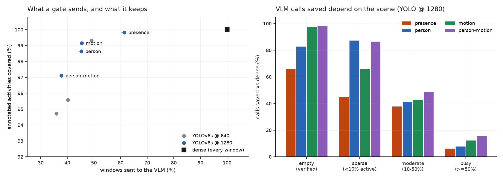
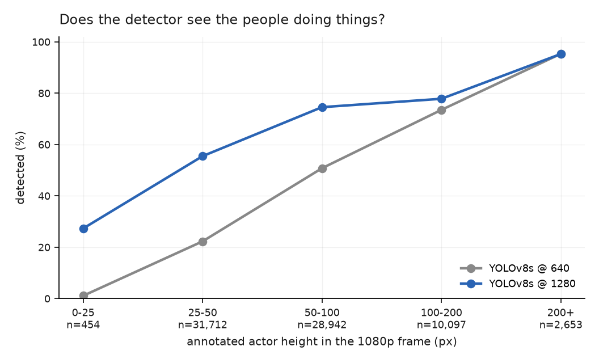
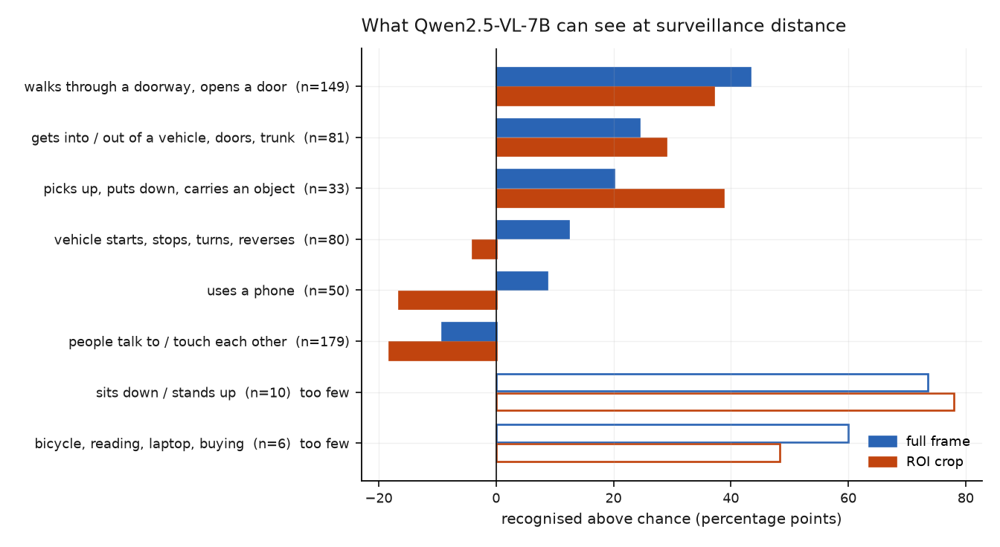
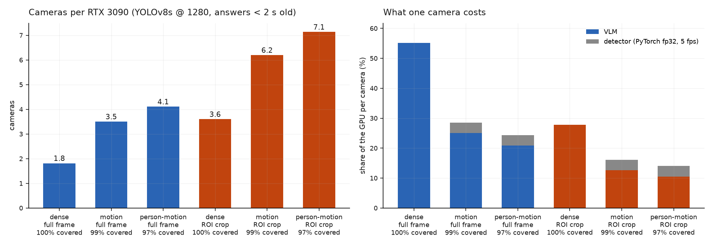
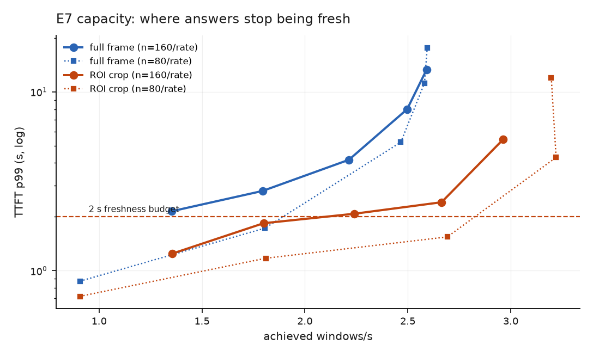

# E7 · The cascade: does a detector gate pay for a VLM?

**Question:** on real surveillance video, how much VLM work does a cheap detector
gate save — and what does it cost in activities the VLM never gets to see?

**Answer:** a YOLO gate keeps **97–99% of annotated activities** in front of the
VLM, loses **at most 1 point** of genuine recognition, and removes a quarter to a
third of the false alarms, while sending the VLM only 38–45% of windows. Measured
live with both models on the card ([E7b](e7b-live.md)), that takes one 3090 from
**5 to 8 cameras**, and to **10** with ROI crops and a TensorRT detector. The
savings are a property of the scene: **98%** of calls on an empty camera,
**12–15%** on a busy one. And the weak link is not the gate — it is what a 7B VLM
can see at surveillance distance.

This is the bench's "next up" question — *do application-level tricks dwarf the
serving layer?* — asked of a VLM. Most serving-layer changes measured in this study moved cost by
a few to tens of percent. This one moves it by 2–4×.

Pre-registered in [PLAN.md §10](https://github.com/sadbodhs/vlm_inference_optimization/blob/main/PLAN.md)
before any measurement, with a dated amendment when a data bug was found (below).

## Setup

- **Data:** MEVA (CC BY 4.0), Kitware annotations — exhaustive for 36 ActEV
  activity types, which is what makes a *missed* activity measurable. 24
  five-minute 1080p clips (2 hours, 3,600 windows), six per duty-cycle bin:
  annotator-verified **empty**, **sparse** (< 10% of the time active),
  **moderate** (10–50%), **busy** (≥ 50%). At most one clip per camera per bin.
- **Windows:** 2 s. The VLM sees **2 frames** per window (E6's knee).
- **Detector:** YOLOv8s (COCO person + vehicle classes), 5 fps, at 640 and 1280.
- **Gates:** `presence` (anything detected), `person`, `motion` (a detection
  appeared, vanished or moved > 0.1× its height), `person-motion`.
- **VLM:** Qwen2.5-VL-7B-AWQ on vLLM, B0 settings with 16 images allowed per
  request. **Full frame** or **ROI crop** (the union of detected people, padded).
  It picks which of eight activity groups are happening, or none.

## The gate: what it sends, and what it keeps

| gate (YOLO @ 1280) | windows sent | activities covered |
|---|---|---|
| `presence` | 61.4% | 99.8% |
| `person` | 45.2% | 98.6% |
| **`motion`** | **45.4%** | **99.1%** |
| `person-motion` | 37.8% | 97.1% |

`presence` saves least because **parked cars never leave**: it fires on a third of
the windows of cameras annotators verified as empty. `motion` ignores them.

**Savings follow the scene, not the gate.** On empty cameras `motion` saves
**97%** of calls; on busy ones **12%**. A single "the cascade saves X%" would be
a statement about this sample's mix of cameras, not about any deployment.

## Detector resolution sets what the gate can see

| person height (px, 1080p) | n | YOLO @ 640 | YOLO @ 1280 |
|---|---|---|---|
| < 25 | 454 | 1% | 27% |
| 25–50 | 31,712 | **22%** | **56%** |
| 50–100 | 28,942 | 51% | 75% |
| 100–200 | 10,097 | 74% | 78% |
| ≥ 200 | 2,653 | 95% | 95% |

Most annotated people in MEVA are **25–100 px tall**, and at 640 the detector
misses most of them. 1280 costs 2× the detector time (3.4 → 7.0 ms/frame) and
buys back 2–3 points of activity coverage on the person gates (95.6 → 98.6%, 94.7 → 97.1%). It also *cuts
false triggers*: on empty cameras `motion` fires on 18% of windows at 640 but 2.6%
at 1280 — the small-input detector flickers on distant cars.

## What the VLM can see

Before the full run, a one-clip pilot on the busiest camera in the corpus — a
group of ~15 people with 16 annotated conversations — answered "nothing" in 149
of 150 windows. At full 1080p (5,351 tokens per window) it answered "nothing" in
all 150. Asked directly, it said *"the people are walking on the sidewalk"* and
that no one was talking. The prompt was not the problem; perception was.

Recognition is scored against a **shuffled baseline**: each window's answer
replaced by a random other window's, which keeps the answer mix and breaks the
link to the frame. Without it the ROI crop looks better than full frame (50.5% vs
38.9% recognised); with it, the crop is *worse* (+9.9 vs +16.9 points above
chance) — it asserts more letters and wins by volume, at **2.4× the false alarms**.

| activity group | full frame | ROI crop | n |
|---|---|---|---|
| walks through a doorway, opens a door | **+43** | +37 | 149 |
| gets into / out of a vehicle | +24 | +29 | 81 |
| picks up, puts down, carries an object | +20 | **+39** | 33 |
| vehicle starts, stops, turns | +12 | **−4** | 80 |
| uses a phone | +9 | −17 | 50 |
| **people talk to / touch each other** | **−9** | −18 | 179 |

- **Visible:** body-scale events — going through a door, getting into a car.
- **Invisible:** hand-scale ones — a phone, a conversation. This is the
  [feature-size rule](task-frontier.md) again, in surveillance.
- **The crop helps what it frames** (objects: +20 → +39) and **destroys what it
  excludes**: it crops to people, so vehicle motion falls to chance.

!!! warning "The VLM's own skill is poorly pinned down"
    Resampling **clips** (activities within a clip share a scene and are not
    independent), the 95% interval on full-frame recognition above chance is
    **[−1, +39] points**. Two hours from 24 cameras cannot pin down how good the
    model is. The gate comparisons below are *paired* — same answers, same clips —
    and are much tighter.

## The gate costs almost nothing in recognition

| cascade (YOLO @ 1280) | recognitions vs dense (paired, 95% CI) | false alarms / camera-hour |
|---|---|---|
| dense, full frame | — | 608 |
| `motion`, full frame | −0.5 pts [−1.4, 0] | 453 |
| `person-motion`, full frame | −1.0 pts [−2.5, −0.3] | 416 |
| dense, ROI crop | — | 1,472 |
| `person-motion`, ROI crop | −1.5 pts [−4.0, −0.2] | **559** |

The windows a gate skips are where the VLM was mostly hallucinating. The gate
also rescues the crop: its false-alarm rate falls from 2.4× dense full frame to
below it (559 vs 608 per hour).

## Cameras per 3090

Usable capacity is the highest measured rate whose TTFT p99 stays inside a 2 s
freshness budget: **0.91 windows/s** full frame (1,315 tokens), **1.80** ROI
(1,065 tokens). Cameras = 1 / (detector share + VLM share), where a camera sends
0.5 windows/s × the gate's call rate.

{ width="600" }

*Both capacity sweeps, both arms. The 80-request sweep reads lower at most rates;
it drew different windows and ran half as long per rate, and the tail of a
latency distribution moves with both. The 160-request sweep is the one used.*

| configuration (YOLO @ 1280) | cameras | activities covered |
|---|---|---|
| dense, full frame | 1.8 | 100% |
| `motion`, full frame | 3.5 | 99.1% |
| `person-motion`, full frame | 4.1 | 97.1% |
| dense, ROI crop | 3.6 | 100% |
| `motion`, ROI crop | 6.2 | 99.1% |
| `person-motion`, ROI crop | **7.1** | 97.1% |

**The detector is not free.** YOLO in PyTorch fp32 at batch 1 costs 7.0 ms per
1280 frame — **3.5% of the GPU per camera at 5 fps**, a quarter of each camera's
budget at the best operating point. The [CV study](https://sadbodhs.github.io/computer_vision_optimization/)
measured YOLOv8s at ~1.2 ms per 640 frame under TensorRT, against 3.4 ms here in
PyTorch. If the same ~3× held at 1280 (not measured), the detector's share would
fall from 3.5% to ~1.2% per camera. The detector's serving stack matters again.

!!! warning "Superseded by the live measurement"
    This table is a time-sharing *model* of a detector and a VLM measured
    separately. [E7b](e7b-live.md) ran both on the card with real-time cameras:
    **5 / 8 / 10** cameras for VLM-alone / `motion` gate / `person-motion` + ROI +
    TensorRT. The model undercounts most where the VLM does all the work (1.8 vs 5),
    because its capacity came from a Poisson sweep and cameras arrive on a beat.

## Predictions: which held

| # | prediction (pre-registered) | measured | verdict |
|---|---|---|---|
| 1 | `presence` fires on ≥ 70% of windows | 61% | **missed** — though it still fires on a third of empty-camera windows |
| 2 | `person-motion`: 15–35% of calls at ≥ 90% recall | 38% at 97% | recall **held**, calls just over |
| 3 | < 50% YOLO recall under 50 px at 640; 1280 recovers most; YOLO < 10% of VLM cost | 1% / 22%; 1280 → 27% / 56%; YOLO ≈ 25% of budget | first **held**, second **partial**, third **failed** |
| 4 | ROI raises recognition ≥ 10 points with fewer tokens | +11.6 raw, 19% fewer tokens — but **−7 points** above chance | **failed** once chance-corrected |
| 5 | > 90% of calls saved on empty cameras, < 30% on busy | 97–98% / 12–15% (motion gates) | **held** |

## What changed from the plan, and why

- **The first gate analysis was void.** MEVA ships annotations in two file
  layouts; the indexer read one and silently skipped 266 of 769 clips, which then
  looked empty. The corpus is far busier than first reported (median clip active
  26% of the time, not 9%). Fixed, re-selected by the same rule, amendment dated in
  PLAN.md. See [corrections](corrections.md).
- **The chance baseline** was added after the first report showed the ROI arm
  "winning" on raw recognition while asserting 2.4× as many letters.
- **Usable capacity** uses the freshness criterion alone. The pre-registered rule
  also required the harness's drift verdict to read "not saturated"; on these
  two-image requests it flagged nearly every rate, including ROI at 1.5/s with a
  400 ms median identical to 2.0/s. The full capacity tables are in
  `results/sweeps/e7-capacity-*.json`.

## Not measured

A tracker between detections; night, rain or UAV footage; a stronger VLM. (The
detector and VLM on the card together, and TensorRT for the detector, are measured
in [E7b](e7b-live.md).) The
recognition task is a coarse eight-group choice, not the 37-way ActEV task — this
measures whether the cascade preserves what the VLM can see, not the VLM's ceiling.
