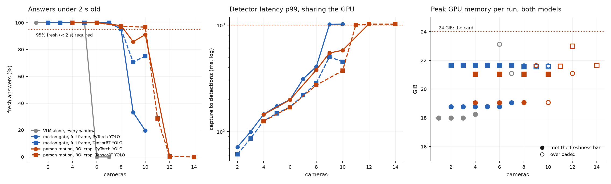
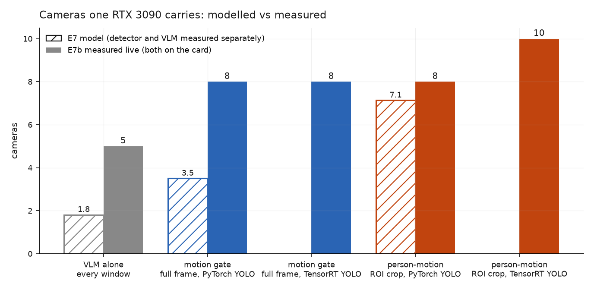

# E7b · The live cascade: detector and VLM on one GPU

**Question:** [E7](e7-cascade.md)'s "cameras per 3090" was a *model*: a detector and
a VLM measured separately, then assumed to share the GPU. Put both on the card at
once, with cameras arriving in real time. How many cameras does one 3090 actually
carry?

**Answer:** both models fit, and both run. **5 cameras** with the VLM analysing
every window; **8** with a YOLO motion gate in front; **10** with the gate, ROI
crops and a TensorRT detector. The cascade's live gain is **1.6–2×**, smaller than
E7 modelled. That isn't because the cascade is worse; the model badly
underestimated the ungated VLM. Past each limit the system **collapses** rather
than degrades, and memory climbs toward the card's ceiling.

Pre-registered in [PLAN.md §11](https://github.com/sadbodhs/vlm_inference_optimization/blob/main/PLAN.md)
before any live run.

## Setup

- **One RTX 3090, two processes.** vLLM (Qwen2.5-VL-7B-AWQ, 16 images per request)
  at `--gpu-memory-utilization 0.80`, and a detector process running the cameras,
  YOLOv8s at 1280, the gate and the VLM client. No MPS or partitioning: the two
  time-slice the GPU by default, as an untuned deployment would.
- **Feasibility, measured first:** vLLM at 0.80 holds 17.6 GiB; YOLO beside it
  adds ~0.5 GiB. **18.1 of 24.0 GiB**, ~5.9 GiB free.
- **Cameras:** N simulated cameras, each replaying a different MEVA clip from E7
  at 5 fps on a wall clock, scenes interleaved empty → sparse → moderate → busy.
  Video decode is not measured: frames are pre-extracted JPEGs.
- **Detector:** one worker, batch 1, in its own process. PyTorch fp32 or a
  TensorRT 10.7 FP16 engine of the same weights, which gives the same detections on
  a test frame. A frame older than 1 s when its turn comes is dropped.
- **Supported** means ≥ 95% of answers arrive under 2 s after the newest frame
  they describe **and** < 1% of detector frames are dropped. 120 s per camera
  count after a 10 s warm-up.

## Result

| configuration | cameras | call rate at the limit | what gives way one camera later |
|---|---|---|---|
| VLM alone, every window | **5** | 100% | the VLM: 100% fresh → **0%** |
| `motion` gate, full frame, PyTorch YOLO | **8** | 31% | both: 33% fresh, detector drops 4% |
| `motion` gate, full frame, TensorRT YOLO | **8** | 31% | the VLM: 71% fresh, detector drops none |
| `person-motion`, ROI crop, PyTorch YOLO | **8** | 29% | 86% fresh |
| `person-motion`, ROI crop, TensorRT YOLO | **10** | 26% | 29% fresh, detector drops 3% |

**The gate buys 5 → 8 cameras (+60%).** ROI crops and a TensorRT detector together
take it to **10 (2×)**.

**TensorRT matters where the detector competes.** With ROI crops the VLM's share of
the GPU drops, the detector's share becomes the margin, and TensorRT buys two
cameras. With full frames the VLM is the limit either way, and both detectors
reach 8. TensorRT still changes the failure: one camera past the limit it drops
**no** frames, where PyTorch drops 4–14%.

**The detector feels the VLM.** YOLO's p99 latency climbs from 60–70 ms at two
cameras to 290–410 ms at the limit, although its own load grows only linearly.
It is waiting behind VLM prefill kernels. Once it waits a full second, frames are
dropped and the gate goes blind.

**Collapse, not degradation.** VLM-alone goes from 100% fresh at 5 cameras to 0% at
6. At 6 and 7 cameras the p95 answer is 22 s and 41 s old and the GPU is 97% busy. A queue that
cannot drain does not degrade gracefully; it falls behind forever.

## Memory, and the two allocations that failed

`--gpu-memory-utilization` sizes the KV cache at startup; **it is not a cap.** Under
sustained two-image load, vLLM grew by **3.5 GiB** (17.6 → 21.0 GiB), ending
**1.4 GiB past its 0.80 budget** of 19.2 GiB, and kept it. Twice, at overload points, its allocator ran out:

| run | peak GPU memory | vLLM allocator |
|---|---|---|
| VLM alone, **6** cameras (one past the limit) | 23.1 of 24.0 GiB | failed to allocate 870 MiB with 575 MiB free; recovered by flushing its cache |
| `person-motion` + TensorRT, **12** cameras (two past) | 23.0 of 24.0 GiB | the same |

No request failed and nothing crashed, but both were under 1 GiB from a hard OOM.
**Every run that met the freshness bar stayed at or below 21.7 GiB.** Co-hosting is safe at
the supported camera counts. Just past them it is not, and at vLLM's default of
0.90 it would likely have crashed.

## E7's model against the live measurement

| configuration | E7 model | measured live |
|---|---|---|
| VLM alone | 1.8 | **5** (2.8×) |
| `motion` gate, full frame, PyTorch | 3.5 | **8** (2.3×) |
| `person-motion`, ROI crop, PyTorch | 7.1 | **8** (+13%) |

The model's capacity came from E7's capacity sweep: **Poisson** arrivals, judged on
**TTFT p99**. Cameras are not Poisson. Each sends one window every 2 s, on a beat,
and that queues far less than random bursts do. E4 saw the same effect with single
frames. The model is most wrong where the VLM does all the work, and nearly right
where the gate and crop have already removed most of it. It also used E7's
all-clip call rates (45%, 38%); two-minute live slices ran at 26–31%.

**Lesson:** capacity for periodic sources has to be measured with periodic
sources. An open-loop Poisson sweep, correct for a request-serving API, undercounts
a camera fleet by more than 2×.

## Predictions: which held

| # | prediction (pre-registered) | measured | verdict |
|---|---|---|---|
| 6 | live cameras within ±30% of E7's model | +13% for ROI; 2.3× and 2.8× for the others | **1 of 3** — failed where the VLM carries the load |
| 7 | the model overstates detector cost, so gated configs meet or beat it | 8 ≥ 3.5, 8 ≥ 7.1 | **held** — but mostly because of the arrival pattern, not the detector |
| 8 | TensorRT adds ≥ 15% cameras for `person-motion` + ROI | 8 → 10 (+25%) | **held** |

## A harness artefact caught on the way

The first version ran the detector as a thread in the measuring process. Its
latency had a 23 ms median and a **345 ms p99** at two cameras. Moved into its own
process, the p99 at two cameras fell to **63 ms**. The tail had been Python's
interpreter lock, held while the VLM client cropped and encoded images, not the
GPU. Every number above is from the out-of-process version.

## Caveats

- **Each camera count is one 120 s run.** Limits are ±1 camera: `motion` +
  TensorRT reads 71% fresh at 9 cameras and 75% at 10.
- **The scene mix changes with N.** Camera *k* always replays the same clip, and
  the first two are an empty and a sparse scene, so call rates at small N are low
  (10%) and rise to ~30% by the limit.
- **One detector worker, batch 1.** Batching across cameras would cut the
  detector's GPU time further, and would matter most for the TensorRT ROI
  configuration, where the detector is the margin.
- **Not measured:** video decode, MPS or MIG partitioning, more than one detector
  worker, a VLM other than Qwen2.5-VL-7B.
