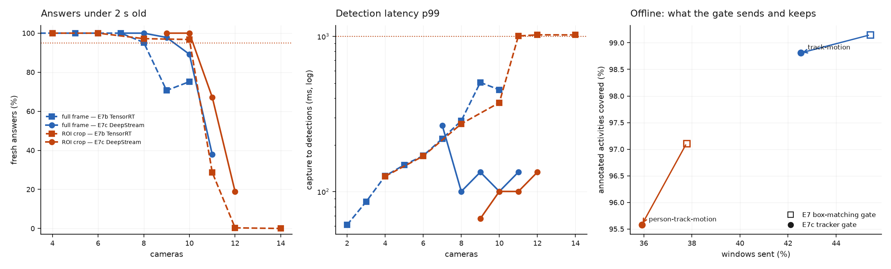

# E7c · The cascade, industry-shaped: DeepStream + tracker

**Question:** NVIDIA's own reference for CV + VLM (the [VSS blueprint](https://docs.nvidia.com/vss/latest/index.html))
builds the CV side as one DeepStream pipeline: hardware decode, a detector batched
across cameras, a multi-object tracker. Its *events* trigger a separate VLM
service. Built that way instead of [E7b](e7b-live.md)'s Python detector, what does
the cascade gain?

**Answer:** **one camera with full frames (8 → 9), none with ROI crops (10 → 10).**
DeepStream takes the detector out of contention: detection latency stays near
0.1 s at every camera count, and no frame is ever late. But in E7b the detector
was never the larger share of the problem. **The VLM is now the only limit.**

Pre-registered in [PLAN.md §12](https://github.com/sadbodhs/vlm_inference_optimization/blob/main/PLAN.md)
before any measurement.

## Setup

- **CV service**, one DeepStream 7.1 pipeline for all N cameras: `filesrc → demux →
  h264parse → nvv4l2decoder` (NVDEC) → `nvstreammux` (batch N) → `nvinfer`
  (YOLOv8s, the same weights, 1280, FP16, conf 0.25, NMS IoU 0.7, **every 6th
  frame**) → `nvtracker` (NvDCF, NVIDIA's perf profile) on **every** frame.
- **Gate on tracks.** A window fires if a tracked person or vehicle is born, is
  lost, or moves more than 0.1× its height (`track-motion`); `person-track-motion`
  counts people only.
- **VLM service:** unchanged from E7b: vLLM at `--gpu-memory-utilization 0.80`, the
  same prompt, the same two frames per window, the same JPEG pixels.
- **Cameras:** the same clips at the same start offsets as E7b, cut from a keyframe
  with no re-encode. All 93 camera files were checked: frame 0 matches the
  labelled frame, at 43–47 dB PSNR.
- **Supported:** ≥ 95% of answers under 2 s old, and detection-path p99 < 1 s.

On its own, the CV service runs **8 cameras at ~780 fps** (decode + YOLO + tracker),
about 26 cameras' worth at 30 fps.

## Does DeepStream see what E7's detector saw?

Checked before comparing any gates. A gate that fires less because its detector
sees less is not a better gate.

| | DeepStream (nvinfer + NvDCF) | ultralytics (E7) |
|---|---|---|
| objects on the same frames | 181,794 | 195,882 |
| E7's boxes matched (IoU ≥ 0.5) | **87.1%** | — |
| annotated people 25–50 px found | 50.3% | 55.5% |
| annotated people 50–100 px found | 72.5% | 74.6% |
| annotated people ≥ 200 px found | 93.7% | 95.3% |

DeepStream sees **slightly less**: 7% fewer objects and 1–5 points fewer small
people. The weights and resolution are the same; the preprocessing path, TensorRT
version and the tracker's probation (a new target must be seen twice) differ.

## The tracker gate, offline

| gate | windows sent | activities covered | on verified-empty cameras |
|---|---|---|---|
| E7 `motion` (box matching) | 45.4% | 99.1% | 2.6% |
| **`track-motion`** (tracker IDs) | **42.5%** | **98.8%** | **1.6%** |
| E7 `person-motion` | 37.8% | 97.1% | 1.7% |
| `person-track-motion` | 35.9% | 95.6% | 0.6% |

**Slightly better, not transformative:** 3 points fewer calls for 0.3 points of
coverage. Some of the saving is the parity deficit above, not the tracker.

## Live, with vLLM on the same card

| configuration | E7b | **E7c** | what gave way |
|---|---|---|---|
| full frame, motion gate | 8 cameras (TensorRT YOLO) | **9** | the VLM: 97.8% fresh at 9 → 89% at 10 |
| ROI crop, person-motion gate | 10 (TensorRT YOLO) | **10** | the VLM: 100% at 10 → 67% at 11 |

**The detector left the critical path.** In E7b, YOLO's p99 latency climbed to
300–1,000 ms near the limit as it queued behind VLM prefill, and past it frames
were dropped. In E7c, detection p99 stays at **70–270 ms at every camera count**,
including the overloaded ones, with no frame late. Batching across cameras and
detecting every 6th frame cut the detector's GPU time enough that it no longer
competes.

**The one extra camera came from that.** At 9 full-frame cameras, both
architectures sent ~30% of windows to the VLM. E7b's answers were 71% fresh, E7c's
97.8%. Same VLM work, less detector interference.

**No allocator failure** this time, although the DeepStream process holds about
1 GiB more than E7b's detector: peaks of 22.4–22.7 GiB of 24.0.

## Predictions: which held

| # | prediction (pre-registered) | measured | verdict |
|---|---|---|---|
| 9 | tracker gate fires less than `motion` at ≥ 98% coverage, and < 1% on empty cameras | 42.5% vs 45.4% at 98.8%; 1.6% on empty | **partial:** fewer calls at ≥ 98%, not < 1% on empty |
| 10 | ROI + DeepStream carries ≥ 11 cameras | 10 | **failed:** the VLM was the limit, not the detector |
| 11 | full-frame gains come from a lower call rate, not detector cost | the gain came from detector cost; call rates matched (~30%) | **failed**, and the reverse holds |

## What it means

The industry-standard architecture is the right one to *run*. Detection latency is
flat, nothing is dropped, and it handles ~26 cameras of CV on its own. But on one
24 GB card it buys one camera, because the VLM does most of the work. More cameras
now have to come from the VLM side: fewer calls, fewer tokens per call, a faster
engine, or the move NVIDIA's reference makes — a dedicated GPU for the VLM.

## Three engineering findings on the way

- **`uridecodebin` hangs with 8 sources.** Isolated in bare `gst-launch`, it hung
  with decode and mux alone: no inference, no tracker. It hung with or without a
  queue per source, and with the new `nvstreammux`. Explicit `filesrc ! demux !
  h264parse ! nvv4l2decoder` chains never hung. Four or fewer happened to work.
- **Python callbacks in the startup path deadlock.** Linking decoder pads in a
  Python `pad-added` callback, and blocking on `get_state()`, both froze the
  pipeline before its first frame. The pipeline is now built with
  `Gst.parse_launch`, so GStreamer links in C; the only Python is the tracker
  probe, once frames flow.
- **`timeout` does not stop a container.** It killed the Docker client; the hung
  container kept 2.6 GB of GPU memory for 32 minutes. The launcher now kills its
  own container by name.

## Caveats

- **File sources can decode ahead of real time.** Median detection latency was
  −33 to +67 ms, so a window could be decided up to a frame or two early. That
  flatters staleness by ~0.1 s at most, against a 2 s budget.
- **One 120 s run per camera count.** Limits are ±1 camera.
- **NVIDIA's perf tracker profile, untuned.** No rule-based events (tripwires,
  zones): MEVA gives no per-camera geometry.
- **Not measured:** MPS; a separate GPU for the VLM; DeepStream's own VLM
  integration (`nvinferserver` with a VLM backend).
