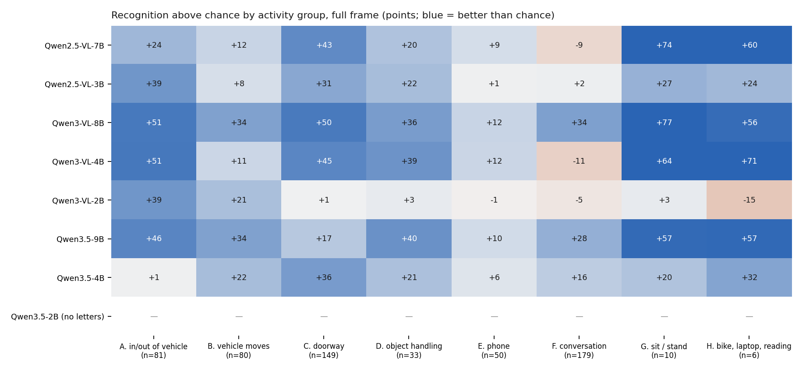
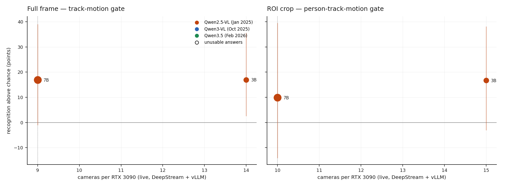

# E7d · Which VLM behind the gate: size and generation

!!! info "In progress — updated 2026-09-24"
    **Recognition is final** for all eight models. **Cameras per 3090** are measured
    for Qwen2.5-VL-7B (E7c) and Qwen2.5-VL-3B; the other six are running now, one
    model at a time, and this page will be updated as they land.

**Question:** after [E7c](e7c-deepstream.md) the VLM is the only limit on how many
cameras one RTX 3090 carries. Is a smaller VLM the lever? Does a *newer* small model
keep the recognition an older, larger one had? And is E7's finding that the VLM
"cannot see phones or conversations" a property of the task, or of the model?

**Answer so far:**

- **Generation matters more than size.** **Qwen3-VL-8B** recognises activities at
  **+39.7 points above chance** against Qwen2.5-VL-7B's +16.9, the only
  difference in the set that is statistically clear.
- **E7's perception limit was the model.** Qwen3-VL-8B recognises conversations at
  **+34 points** above chance, and Qwen3.5-9B at +28, where the 7B was *below*
  chance. Phones stay hard for every model (≤ +12).
- **Half the size, same recognition, 1.5× the cameras.** Qwen2.5-VL-3B matches the
  7B's recognition exactly (+16.9) and carries **14 cameras full-frame (7B: 9)** and
  **15 with ROI crops (7B: 10)**.
- **The 2B models are unusable here.** Qwen3-VL-2B ticks nearly every box
  (9,254 false alarms an hour); Qwen3.5-2B answers in prose and never gives a
  letter.

Pre-registered in [PLAN.md §13](https://github.com/sadbodhs/vlm_inference_optimization/blob/main/PLAN.md)
before any measurement.

## Setup

- **Eight 4-bit models, one variable.** Everything but the model is E7/E7c's:
  vLLM v0.29.0, 16 images per request, 16,384 context, no prefix caching, util
  0.80, temperature 0, 16 output tokens, the same prompt and the same pixels
  (≤ 451,584 per frame). Checkpoints are pinned by revision in `arms/E_*.yaml`.

    | generation | models | image tokens per call (full / ROI) |
    |---|---|---|
    | Qwen2.5-VL (Jan 2025) | 7B, 3B | 1,298 / 1,056 |
    | Qwen3-VL (Oct 2025) | 8B, 4B, 2B | 1,035 / 842 |
    | Qwen3.5 (Feb 2026) | 9B, 4B, 2B — thinking off | 1,041 / 848 |

    The newer generations use 32 px per visual token against 28, so the same pixels
    cost them ~20% fewer tokens. Pixels are equalised; tokens are not.
- **Recognition:** E7's VLM stage on every window of all 24 clips (3,600 full-frame,
  2,192 ROI), scored against the shuffled-answer chance baseline. Models are
  compared by a **paired bootstrap over clips**: each draw resamples clips once and
  scores both models on it.
- **Cameras:** E7c's live pipeline unchanged (DeepStream + NvDCF tracker gate,
  vLLM on the same card), stepping camera counts up by 2 until two failures, then
  filling the gap. Same bar: ≥ 95% of answers under 2 s old, detection p99 < 1 s.

## Recognition

| model | on disk | above chance, full frame | vs 7B (95% interval) | false alarms / h | answers in format |
|---|---|---|---|---|---|
| Qwen2.5-VL-7B (E7) | 6.9 GB | +16.9 | — | 608 | 100% |
| Qwen2.5-VL-3B | 3.4 GB | +16.9 | +0.0 [−10.8, +8.4] | 674 | 100% |
| **Qwen3-VL-8B** | 7.6 GB | **+39.7** | **+22.8 [+8.5, +31.8]** | 804 | 100% |
| Qwen3-VL-4B | 4.4 GB | +21.6 | +4.7 [−7.0, +13.9] | 726 | 100% |
| Qwen3-VL-2B | 2.2 GB | +7.0 | −9.9 [−35.8, +4.1] | 9,254 | 100% |
| Qwen3.5-9B | 9.1 GB | +28.5 | +11.6 [−10.3, +24.6] | 1,512 | 96% |
| Qwen3.5-4B | 4.0 GB | +19.5 | +2.6 [−15.7, +11.7] | **102** | 95% |
| Qwen3.5-2B | 2.5 GB | 0 | −16.9 [−40.2, −0.8] | 0 | **0%** |

With ROI crops: Qwen3-VL-8B +36.6 (+26.7 over the 7B, [+10.6, +43.4]), Qwen3.5-9B
+25.8, Qwen3.5-4B +24.7, Qwen3-VL-4B +23.3, Qwen2.5-VL-3B +16.7, Qwen2.5-VL-7B +9.9.

**What the table says:**

- **Only Qwen3-VL-8B is clearly better** than the 7B. Every ≤ 4B model is
  statistically indistinguishable from it; two hours of video from 24 cameras
  cannot separate differences smaller than ~10 points.
- **Conversations are visible to newer models.** Qwen2.5-VL-7B: −9 on
  "people talk to or touch each other". Qwen3-VL-8B: **+34**. Qwen3.5-9B: +28.
  Qwen3.5-4B: +16. E7 read the 7B's failure as the
  [feature-size rule](task-frontier.md), a limit of the task at surveillance
  distance. It was a limit of that model.
- **Phones remain hard for all of them:** the best is +12, and n = 50.
- **Qwen3.5-4B is the precise one:** one-sixth of the 7B's false alarms, at the same
  recognition. It answers "N" (nothing happening) on 82% of windows.
- **Same score, different strengths.** The 3B beats the 7B on getting into or out of
  vehicles (+39 vs +24) and loses on sitting or standing (+27 vs +74, n = 10).

### Two failure modes at 2B

- **Qwen3-VL-2B asserts nearly everything.** Its most common answer is
  "A, B, C, D, E, F, G, H" (926 of 3,600 windows). Its chance baseline is 90%, so
  almost nothing it says carries information.
- **Qwen3.5-2B does not follow the format.** With thinking off it still reasons in
  prose: *"To determine the correct answer, we must analyze…"*. The 16-token
  answer budget ends before any letter. A longer budget might recover an answer, at
  many times the decode cost; that was not the pre-registered test.

The larger Qwen3.5 models do this too, though less: with ROI crops, 25% (4B) and
33% (9B) of their answers are prose, scored as asserting nothing. Their ROI numbers
are a lower bound.

## Cameras per 3090

| model | full frame, `track-motion` | ROI, `person-track-motion` | what gave way one camera later |
|---|---|---|---|
| Qwen2.5-VL-7B ([E7c](e7c-deepstream.md)) | 9 | 10 | the VLM |
| **Qwen2.5-VL-3B** | **14** (1.56×) | **15** (1.5×) | the VLM: 83% fresh at 15 full-frame; 63% at 16 ROI |
| Qwen3.5-4B | running | running | |
| Qwen3-VL-4B, Qwen3-VL-8B, Qwen3.5-9B, both 2Bs | queued | queued | |

The 3B gains 1.5×, not the 2.3× its parameter count suggests: it keeps the 7B's
~670M-parameter vision encoder, which does the same work per image.

## Memory: a smaller model does not free the card by itself

vLLM sizes its memory from `--gpu-memory-utilization`, not from the model. At 0.80
the 3B reserved the same budget as the 7B and spent the difference on KV cache.
Under load it then grew past the budget, as in [E7b](e7b-live.md):

| Qwen2.5-VL-3B | peak GPU memory |
|---|---|
| first run (6 cameras) | 20.8 GiB of 24.0 |
| at its full-frame limit (14 cameras) | 21.2 GiB |
| at its ROI limit (15 cameras) | 23.2 GiB |
| highest seen (18 cameras, ROI, overloaded) | **23.4 GiB** — closer to the ceiling than the 7B ever came |

No allocation failed. The pre-registered test of whether a small model *can* free
the card — the best ≤ 4B model rerun at util 0.40 — follows the camera sweep.

## Predictions so far

| # | prediction (pre-registered) | measured | verdict |
|---|---|---|---|
| 12 | Qwen2.5-VL-3B carries 1.4–2.0× the 7B's cameras | 1.56× full, 1.5× ROI | **held** |
| 13 | …and its full-frame lift is lower than the 7B's | +0.0 points [−10.8, +8.4] | **failed** — no measurable loss |
| 14 | a ≤ 4B Qwen3-VL/Qwen3.5 model is not significantly below the 7B **and** carries ≥ 1.4× its cameras | recognition: Qwen3-VL-4B and Qwen3.5-4B not below | pending cameras |
| 15 | no model beats chance by > 10 points on phones or conversations | Qwen3-VL-8B +34 on conversations, +12 on phones | **failed** |
| 16 | at util 0.40 the chosen model loses ≤ 1 camera | — | pending |

## Caveats

- **Recognition intervals are wide.** 24 clips, and activities within a clip are
  not independent. Only the Qwen3-VL-8B difference clears it.
- **One prompt, one answer format, 16 tokens.** A model that reasons first is
  penalised by design: a deployment parsing letters would get nothing either.
- **One 120 s run per camera count;** limits are ±1 camera. The 3B's first
  full-frame run (6 cameras) failed on detection latency alone (1.3 s p99, the
  first run after start-up), while 8–14 all passed; the limit is unaffected.
- **Memory carries over between runs.** vLLM keeps what it grows, so later runs
  start higher. Peaks are per run, not per camera count in isolation.
- **Not measured:** models outside the Qwen family, FP16 variants, thinking mode,
  Qwen3.5-0.8B, Qwen3.6 (27B and 35B only).
