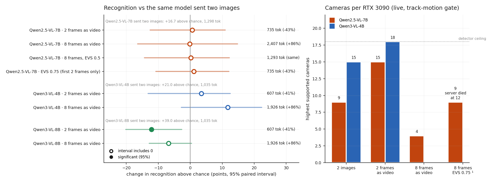

# E8 · Send the window as a video: frame merging and EVS

**Question:** every experiment so far sent a 2-second window to the VLM as **two
images**. Qwen's vision encoder can take the same frames as **one video**, which
merges each pair of frames into one set of tokens. vLLM can then prune the video
tokens that do not change between frames (EVS, `--video-pruning-rate`). Does either
buy cameras per RTX 3090 **without costing recognition**? And can EVS give the VLM
8 frames for the token cost of 2?

A token saving that loses recognition is not a saving, so recognition decided:
each input is paired against the same model sent two images.

**Answer:**

- **Video mode buys cameras.** Sending the same two frames as one video cuts prompt
  tokens by **41–43%**. Qwen2.5-VL-7B goes from **9 to 15 cameras**. Qwen3-VL-4B goes
  from 15 to **18**, where the detector becomes the limit.
- **It is not free on the best model.** Qwen3-VL-8B loses **12 points** of
  recognition above chance (−12.1, 95% interval [−20.1, −2.7]). That is the only
  significant difference in the experiment. On the 7B and the 4B no change was
  measurable, though the intervals are ±12 points wide.
- **Every video input raises false alarms, 1.4–2.2×.** The newer models name an
  activity in about twice as many windows (Qwen3-VL-8B answers "nothing" on 30% of
  windows instead of 60%).
- **Eight frames are not a general gain.** Overall: no change on the 7B, +11.8 on the
  4B (not significant; it comes from conversations), −6.8 on the 8B. Unpruned, they
  cost cameras: the 7B drops from 9 to 4.
- **EVS buys no cameras.** At rate 0.5, 8 frames cost 1,293 tokens (as much as two
  images) with recognition unchanged. At rate 0.75 the live result is **9 cameras,
  the same as two images**: EVS prunes after the vision encoder, which still
  processes all 8 frames. *Corrected 2026-10-04:* rate 0.75 keeps only the first
  frame pair (see the note below), so it is not a pruned 8-frame input.
- **EVS is not production-safe in vLLM v0.29.0.** On Qwen3-VL it crashes the server on
  every video request. On Qwen2.5-VL, under overload, it **runs the vision encoder
  out of memory and kills the server**, where every other input just answers late.

**For a deployment:** with a mid-size model (Qwen2.5-VL-7B, Qwen3-VL-4B), send two
frames as a video for 1.2–1.7× the cameras, if roughly twice the false alarms are
acceptable. With the most accurate model (Qwen3-VL-8B), keep sending images. EVS is
not a capacity lever in this pipeline.

Pre-registered in [PLAN.md §14](https://github.com/sadbodhs/vlm_inference_optimization/blob/main/PLAN.md)
before any measurement.

## Setup

- **Five inputs, one variable.** Everything else is [E7d](e7d-models.md): vLLM
  v0.29.0, util 0.80, temperature 0, 16 output tokens, ≤ 451,584 px per frame, the
  same 24 MEVA clips (3,600 windows), full frame.

    | input | what is sent per 2 s window |
    |---|---|
    | 2 images (E7–E7d) | frames 18 and 48 as two images |
    | 2 frames as video | the same two frames as one video, fps 1 |
    | 8 frames as video | frames 6, 12, …, 48 as one video, fps 5 |
    | 8 frames, EVS 0.5 / 0.75 | the same, server at `--video-pruning-rate 0.5` / `0.75` |

    Every input ends on frame 48, so in the live run all of them are sent at the same
    moment. The video prompt says "this short clip" instead of "these two frames
    taken one second apart"; nothing else in the question changes.
- **Models:** Qwen2.5-VL-7B (all inputs); Qwen3-VL-4B and Qwen3-VL-8B (images and
  video, no EVS: see below).
- **Recognition:** every window, scored as in E7d. Each input is compared with the
  same model sent two images by a **paired bootstrap over clips**: each draw resamples
  clips once and scores both inputs on it. The two-image runs were repeated, not
  reused from E7d, and reproduce it: +16.7 vs +16.9 (7B), +39.0 vs +39.7 (8B).
- **Cameras:** E7c's live pipeline unchanged (DeepStream + NvDCF, `track-motion`
  gate), with only the request changed. Camera counts step up by 2 until two
  failures, then the gap is filled. Same bar: ≥ 95% of answers under 2 s old,
  detection p99 < 1 s.

## Why video mode is cheaper

Qwen's vision encoder cuts its input into patches 2 frames deep. An **image** is
copied into both slots of each patch, so two images cost two full sets of tokens.
A **video** of the same two frames fills the two slots with two different frames:
one set of tokens. That is the whole 43% saving, and it saves vision-encoder work
too, not only LLM prefill. The price is that each token now mixes two moments one
second apart.

**EVS** works on video only. After the encoder, it compares each merged frame pair
with the previous one and drops the tokens that changed least. The first pair is
always kept whole, so a 2-frame video has nothing to prune. It saves LLM prefill and
KV cache; the encoder has already done its full work.

!!! warning "Corrected 2026-10-04: at rate 0.75, EVS keeps only the first two frames"
    EVS keeps a fixed share of tokens, (1 − rate) × all tokens, and the always-kept
    first pair counts toward it. Eight frames are 4 merged pairs of 576 tokens, so at
    rate 0.75 the budget is 576 tokens: exactly the first pair (frames 6 and 12,
    0.2 s apart), and nothing of the other six frames. This page first described it
    as "8 frames at the 2-frame video's cost with recognition unchanged". That was
    wrong. Its recognition (+17.9) is that of a 2-frame video of the window's first
    0.2 s. Rate 0.5 (1,152 visual tokens: the first pair plus the 576 most-changed
    tokens of the other three) is the only pruned 8-frame input measured here. The
    camera count (9) and the out-of-memory crash stand: the encoder still processed
    all 8 frames. Found while sizing E9 (`vllm/multimodal/video_prune/evs.py`,
    `compute_retained_tokens_count`). See [Corrections](corrections.md).

## Recognition

| model | sent as | prompt tokens | above chance | vs two images (95% interval) | false alarms / h |
|---|---|---|---|---|---|
| Qwen2.5-VL-7B | 2 images | 1,298 | +16.7 | — | 601 |
| | 2 frames as video | 735 | +17.4 | +0.6 [−12.5, +10.9] | 1,023 |
| | 8 frames as video | 2,407 | +16.6 | −0.2 [−16.5, +14.8] | 1,176 |
| | 8 frames, EVS 0.5 | 1,293 | +16.9 | +0.2 [−14.3, +12.3] | 1,052 |
| | 8 frames, EVS 0.75 | 735 | +17.9 | +1.1 [−10.8, +12.1] | 992 |
| Qwen3-VL-4B | 2 images | 1,035 | +21.0 | — | 726 |
| | 2 frames as video | 607 | +24.5 | +3.5 [−13.2, +12.5] | 1,567 |
| | 8 frames as video | 1,926 | +32.8 | +11.8 [−2.8, +22.4] | 1,074 |
| **Qwen3-VL-8B** | 2 images | 1,035 | **+39.0** | — | 804 |
| | 2 frames as video | 607 | +26.9 | **−12.1 [−20.1, −2.7]** | 1,370 |
| | 8 frames as video | 1,926 | +32.3 | −6.8 [−12.8, +0.4] | 1,102 |

With 1,000 bootstrap draws instead of 300 the 8B's interval is [−21.5, −2.8]; no
verdict changes.

**What the table says:**

- **The stronger the model, the more video mode costs it.** The 7B does not use the
  detail it loses; the 8B did. Its loss is spread over doorways (+52 → +33), vehicle
  moves (+32 → +19) and conversations (+31 → +14).
- **False alarms are the cost the lift hides.** The lift subtracts a shuffled-answer
  baseline, so a model that names more activities everywhere gains nothing by it.
  A deployment pays for every alert, though. The 7B gives more blanket answers (7–8
  of the 8 letters: 27 windows with images, 98 as a 2-frame video). The Qwen3-VL
  models name *something* far more often: the 4B answers "nothing" on 68% of windows
  with images, 37% with a 2-frame video.
- **EVS 0.75 scored highest of the 7B's video inputs** (+17.9, fewest false alarms),
  but it kept only frames 6 and 12 (corrected note above). None of these
  differences is significant.

### By activity group

Recognition above chance (points), full frame. Group sizes: A 81, B 80, C 149, D 33,
E 50, F 179, G 10, H 6. G and H are too small to read.

| model | sent as | A in/out of vehicle | B vehicle moves | C doorway | D object | E phone | F conversation | G sit/stand | H other |
|---|---|---|---|---|---|---|---|---|---|
| Qwen2.5-VL-7B | 2 images | +25 | +12 | +43 | +12 | +8 | −8 | +73 | +61 |
| | 2 frames as video | +40 | +21 | +43 | +23 | −19 | −9 | +43 | +31 |
| | 8 frames as video | +48 | +29 | +42 | +32 | −8 | −23 | +61 | +33 |
| | 8 frames, EVS 0.75 | +35 | +11 | +40 | +17 | −6 | −2 | +64 | +47 |
| Qwen3-VL-4B | 2 images | +48 | +11 | +45 | +40 | +11 | −11 | +63 | +71 |
| | 2 frames as video | +47 | +20 | +23 | +26 | −1 | +21 | +54 | +73 |
| | 8 frames as video | +47 | +19 | +52 | +30 | +6 | +22 | +61 | +69 |
| Qwen3-VL-8B | 2 images | +51 | +32 | +52 | +36 | +13 | +31 | +77 | +56 |
| | 2 frames as video | +48 | +19 | +33 | +35 | +15 | +14 | +64 | +56 |
| | 8 frames as video | +52 | +19 | +42 | +38 | +18 | +21 | +70 | +70 |

- **On the 7B, eight frames help vehicles and objects** (A +25 → +48, B +12 → +29,
  D +12 → +32) and hurt conversations (−8 → −23). The two cancel in the total.
- **On the 4B, the gain is conversations** (−11 → +22), not the state changes
  (A, C, G) the registration predicted.

## Cameras per 3090

| model | 2 images | 2 frames as video | 8 frames as video | 8 frames, EVS 0.75 |
|---|---|---|---|---|
| Qwen2.5-VL-7B | 9 | **15** (1.67×) | 4 | 9 ¹ |
| Qwen3-VL-4B | 15 ² | **18** (detector limit) | not run | not run (EVS crash) |

¹ The server died at 12 cameras, in the first sweep and in a rerun (below). The
9-camera point is from the rerun: the first sweep ran it against a dead server.
² E7d measured 16. Here 16 missed the bar at 91.8% fresh: the ±1 of a single run.

- **Fewer tokens is more cameras, nearly in proportion.** The 7B's 43% token cut
  gives 1.67× the cameras. At 12 cameras the two-image input fell to 1% fresh
  answers; the video input stayed at 100%.
- **The 4B's video input reaches the detector ceiling.** At 19–22 cameras detection
  p99 rose past 2 s (the bar is 1 s), as at E7d's ceiling. At 18 the VLM was still
  100% fresh, so this input moves the first limit from the VLM to the CV side.
- **Unpruned 8 frames cost more than half the cameras.** One 8-frame request takes
  ~0.85 s alone, and two overlapping ones break the 2 s freshness budget.
- **EVS recovers the 8-frame input to exactly the baseline, 9, no further.** Its
  prompts are as short as the 2-frame video's, but its encoder work is twice the two
  images' (4 merged pairs against 2 duplicated images), and the encoder runs before
  any pruning. (At this rate the prompt holds only the first frame pair; the
  encoder still processes all four.)

### EVS fails by crashing

With EVS on, the 7B's server died at 12 cameras, twice. The rerun streamed the
server log to a file (`results/e8/server-live-evs-rerun.log`):

- `torch.OutOfMemoryError: CUDA out of memory. Tried to allocate 476.00 MiB`, inside
  the **vision encoder** (`qwen2_5_vl.py:343`), with **23 requests running** and
  KV cache only 10% used.
- Our reading: vLLM admits requests by their **pruned** token count, so under load it
  lets about 3× more encoder work into one step than it set memory aside for: each
  8-frame request is counted as 735 tokens, but the encoder produces 2,407. Unpruned 8 frames, counted at full size, never crashed: past their limit they
  answered late, like every other input.
- A deployment cannot rely on overload degrading gracefully with EVS on: the engine
  dies and every camera loses its answers.

On Qwen3-VL, vLLM v0.29.0 fails earlier: every video request with EVS on crashes the
engine (`evs.py:338 recompute_mrope_positions`, a tensor-size mismatch), at 2 and 8
frames. The June 2026 Qwen3-VL EVS fix is in this version; this is a different bug.

## Predictions: which held

| # | prediction (pre-registered) | measured | verdict |
|---|---|---|---|
| 17 | for all three models, a 2-frame video is not significantly below two images, at ≥ 40% fewer tokens | tokens −43 / −41 / −41%; 7B +0.6, 4B +3.5 (not significant); **8B −12.1 [−20.1, −2.7]** | **failed** (on the 8B) |
| 18 | 8-frame video is significantly above two images on the 7B and one Qwen3-VL model, mostly in groups A, C, G | 7B −0.2, 4B +11.8 [−2.8, +22.4], 8B −6.8; the 4B's gain is in conversations (F) | **failed** |
| 19 | EVS 0.75 keeps ≥ 75% of the 8-frame gain over the 2-frame video on the 7B, at ≤ 1.1× its tokens | no 8-frame gain on the 7B to keep; tokens 1.00× | **untestable**, as registered. *Also ill-posed:* at 0.75 EVS keeps only the first pair by construction (corrected note above) |
| 20 | a 2-frame video carries ≥ 1.4× the 7B's cameras; the 4B reaches the ~18 detector ceiling | 7B 9 → 15 (1.67×); 4B 15 → 18, detector-limited above | **held** |
| 21 | EVS 0.75 carries within ±2 of two images' cameras and fewer than the 2-frame video; unpruned 8 frames fewer than two images | 9 vs 9 and 15; 4 vs 9 | **held** |

## Deviations from the registration

- **The 7B's EVS 0.75 camera count comes from a rerun.** The server died at 12
  cameras, and the sweep's next count (9) ran against the dead server. The rerun
  (`scripts/e8_evs_rerun.sh`) used the same arm, ran 9 and 12 cameras after one
  discarded warm-up, and kept the server log. 9 passed; 12 crashed again. The
  report merges the two sweeps, rerun rows replacing the original at the counts it ran.
- Nothing else changed. EVS on Qwen3-VL was excluded before measurement (the crash
  was known from the feasibility check).

## Caveats

- **Recognition intervals are wide** (24 clips, ±11–16 points). "No significant
  change" on the 7B and the 4B rules out large losses, not small ones.
- **One prompt.** The video prompt differs by one sentence; a model may read
  "clip" differently from "two frames", and that is part of what was measured.
- **Fixed cameras only.** MEVA cameras do not move, the case EVS is built for. On a
  moving camera every token changes and EVS has nothing to prune.
- **One 120 s run per camera count;** limits are ±1 camera.
- **One vLLM version** (v0.29.0). Both EVS failures may be fixed in a later release;
  the 2-frame video result does not depend on EVS.
- **Not measured:** EVS on Qwen3-VL, ROI crops as video, frame counts other than 2
  and 8, pruning rates other than 0.5 and 0.75, encoder-side token pruning, and live
  cameras for the 8B and for the 4B's 8-frame input.
