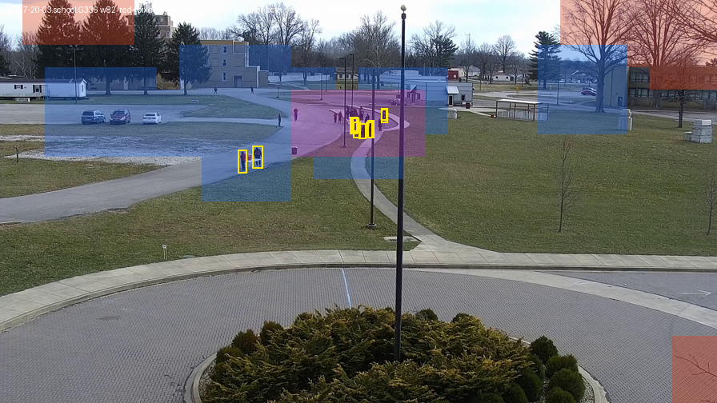
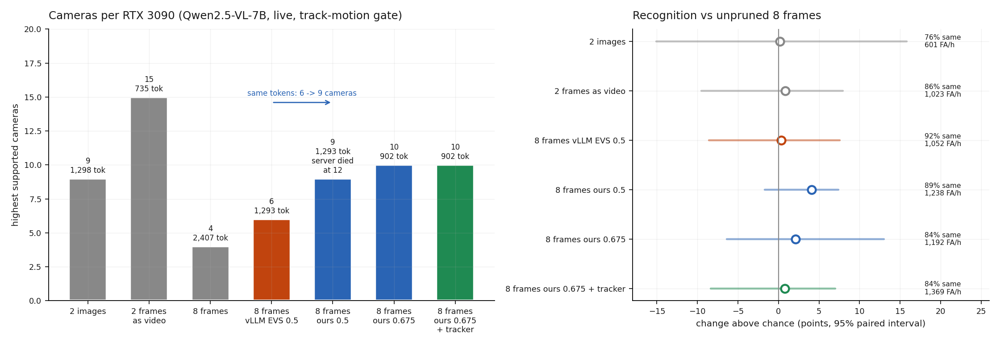

# E9 · Prune before the encoder

**Question:** [E8](e8-video-input.md) found that vLLM's EVS, which prunes video
tokens *after* the vision encoder, buys no cameras: the encoder still processes
every frame. If the tokens are chosen from the **pixels** and the encoder runs
**only on the patches that are kept**, does an 8-frame window become cheap enough
to buy cameras, without costing recognition? And does the DeepStream tracker, which
the pipeline already runs, choose those patches better than pixel change?

**Answer:**

- **At the same token count, pruning before the encoder carries 50% more cameras.**
  With 1,293 prompt tokens per request, vLLM's EVS supports **6 cameras** and ours
  **9**. Recognition is not lower: +3.7 points above vLLM EVS (interval −4.0 to
  +10.7) and +4.1 above unpruned 8 frames (−1.7 to +7.4).
- **Pruned harder (902 tokens), 8 frames carry 10 cameras**, against 4 unpruned:
  2.5×, again without a measurable loss (+2.1 vs unpruned, −6.4 to +13.0).
- **The encoder does 2.8× less work** (240 → 86 ms for 8 frames). The tokens it keeps
  from later frames lose context and **drift** from their full-frame values (mean
  cosine 0.48), yet 84–89% of answers are identical to unpruned 8 frames.
- **It does not beat sending 2 frames as a video** (15 cameras at the same
  recognition). For capacity alone, that is still the 7B's best input. Pruned 8
  frames are the cheapest way to see a whole window, not a way past 2 frames.
- **The tracker did not help.** Freezing everything outside the tracker's boxes gave
  the same 10 cameras, no recognition gain, and **more** false alarms (1,369 vs
  1,192 per hour). Pixel change alone chose better.
- **The encoder out-of-memory crash is gone; a second vLLM bug is not.** At 902
  tokens our server survived every overload up to 14 cameras, where vLLM's EVS had
  died at 12. At 1,293 tokens it died at 12, in vLLM's own position code for
  pruned video (`evs.py:298`), which stock EVS also uses.

Pre-registered in [PLAN.md §15](https://github.com/sadbodhs/vlm_inference_optimization/blob/main/PLAN.md)
before any full measurement. GPU time: **3.4 hours** of a 12-hour budget
(`results/e9/gpu_ledger.tsv`).

## How it works

Qwen merges each pair of video frames into one grid of 28 px units, one token per
unit. vLLM's EVS keeps a fixed share of those tokens, always including the whole
first pair, but only *after* running the encoder on all of them.

The plugin ([`plugins/vlm_prune`](https://github.com/sadbodhs/vlm_inference_optimization/tree/main/plugins/vlm_prune),
installed in `vlmbench-vllm-pevs:v0.29.0` = vLLM v0.29.0 + the plugin) subclasses
vLLM's Qwen2.5-VL and keeps EVS's token count, so prompt placeholders, positions
and scheduling are untouched. It changes two things:

1. **Which tokens:** each unit of a later pair is scored by its mean pixel change
   against the same unit of the previous pair. The first pair is kept whole, then
   the highest-scoring units up to EVS's count.
2. **What the encoder sees:** only the kept units. Qwen2.5-VL's window attention
   (112 px windows) and per-frame-pair full attention are rebuilt for the subset,
   so every kept patch keeps its true position, window and frame pair.

The **tracker** variant changes only the client: after the first pair, pixels
outside the tracker's boxes (+60 px) are copied from the first pair, so the pixel
ranking can only pick units under tracked objects.

### What was checked before the full runs

| check | result |
|---|---|
| Subset path with every unit kept, vs the full encoder | identical (minimum cosine 1.00000) |
| First pair (always kept) after pruning later pairs | identical (1.0000) |
| Encoder time, 8 frames, full vs rate 0.675 (707 of 2,176 units) | 240 ms → **86 ms** |
| Kept later-pair tokens vs their full-context values | mean cosine **0.48** |
| The same, keeping whole 112 px windows | 0.49: dropped, it also agreed less and raised false alarms |

Qwen2.5-VL attends within a frame pair, never across pairs, so pruning later pairs
cannot change the first. The drift of the kept later-pair tokens is real: the
encoder's last layer attends across the whole frame, and pruning removes most of
it.

**How much there is to prune** (step A, CPU only, all 3,600 windows): after the
first pair, only 2–10% of 28 px blocks change (16–20% in busy clips), so the token
count is set by the first pair, not by motion.

{ width="560" }

## Recognition

Every window of the 24 clips, scored as E8. Each arm is paired against unpruned
8 frames and against vLLM EVS 0.5 (bootstrap over clips, 300 draws).



| input (Qwen2.5-VL-7B) | prompt tokens | above chance | vs unpruned 8 frames | vs vLLM EVS 0.5 | false alarms / h | same answer as 8 frames |
|---|---|---|---|---|---|---|
| 2 images (E8) | 1,298 | +16.7 | +0.2 [−15.1, +15.8] | −0.2 [−12.5, +13.6] | 601 | 76% |
| 2 frames as video (E8) | 735 | +17.4 | +0.8 [−9.5, +8.0] | +0.5 [−6.3, +5.9] | 1,023 | 86% |
| 8 frames (E8) | 2,407 | +16.6 | — | −0.3 [−7.6, +8.5] | 1,176 | 100% |
| 8 frames, vLLM EVS 0.5 (E8) | 1,293 | +16.9 | +0.3 [−8.6, +7.6] | — | 1,052 | 92% |
| **8 frames, ours 0.5** | 1,293 | **+20.6** | +4.1 [−1.7, +7.4] | +3.7 [−4.0, +10.7] | 1,238 | 89% |
| **8 frames, ours 0.675** | 902 | +18.7 | +2.1 [−6.4, +13.0] | +1.8 [−3.4, +7.1] | 1,192 | 84% |
| 8 frames, ours 0.675 + tracker | 902 | +17.3 | +0.8 [−8.4, +7.0] | +0.4 [−10.6, +8.2] | 1,369 | 84% |

- **No pruned arm is significantly worse than anything it was compared with.** Both
  of ours lean positive, which the intervals do not let us claim.
- **Drifted tokens did not mislead the model.** Our 0.5 arm sends the same number of
  tokens as vLLM EVS 0.5, which keeps full-context embeddings, and scores at least
  as well.
- **False alarms stay where 8-frame video put them** (1,192–1,238 per hour), except
  with the tracker (1,369).

## Cameras per 3090

E8's live pipeline unchanged (DeepStream + NvDCF, `track-motion` gate, full frame,
the same cameras and bar: ≥ 95% of answers under 2 s old).

| input | prompt tokens | cameras | what happened above the limit |
|---|---|---|---|
| 2 images (E8) | 1,298 | 9 | answers late |
| 2 frames as video (E8) | 735 | **15** | answers late |
| 8 frames (E8) | 2,407 | 4 | answers late |
| 8 frames, vLLM EVS 0.75 (E8; first pair only) | 735 | 9 | **server died at 12** (encoder out of memory) |
| 8 frames, vLLM EVS 0.5 | 1,293 | **6** | answers late (tested to 10) |
| **8 frames, ours 0.5** | 1,293 | **9** ¹ | **server died at 12** (`evs.py:298`, see below) |
| **8 frames, ours 0.675** | 902 | **10** | answers late, tested to 14 |
| 8 frames, ours 0.675 + tracker | 902 | 10 | answers late, tested to 14 |

¹ From a rerun with a fresh server: the sweep's 9-camera point ran against the
server that had died at 12 (`scripts/e9_rerun.sh`, 97.1% fresh).

- **Where you prune decides what it buys.** At identical prompts, pruning before the
  encoder gives +3 cameras (6 → 9) by skipping encoder work vLLM's EVS still does.
- **Fewer tokens bought less than predicted.** Cutting from 1,293 to 902 tokens
  added one camera (9 → 10), and 902 tokens is still 5 cameras short of the 2-frame
  video's 735. Something other than the encoder and prompt length now limits these
  requests, but this experiment did not measure what. Candidates: decoding and
  preprocessing 8 frames on the CPU in vLLM's front end, and the GPU-to-CPU
  synchronisations the plugin adds per request.

### The crash that remains

With our plugin at rate 0.5, the server died at 12 cameras with ~15 s of queue
behind it:

```
vllm/multimodal/video_prune/evs.py, line 298, in recompute_mrope_positions
    next_vision_start_token = vision_start_indices[
IndexError: index 0 is out of bounds for dimension 0 with size 0
```

This is vLLM's own position recomputation for pruned video, the code stock EVS
uses too, not the plugin. It fired only under deep overload, which suggests
requests resumed partway through (`num_computed_tokens > 0`); the same family as
upstream issue #48833. The stock EVS 0.5 sweep stopped at 10 cameras, so whether it
hits the same error at 12 was not tested. The encoder out-of-memory crash of E8 did
not recur in any plugin run.

## Predictions: which held

| # | prediction (pre-registered) | measured | verdict |
|---|---|---|---|
| 22 | ours at 0.675 carries ≥ 12 cameras | 10 | **failed** |
| 23 | at the same tokens, ours at 0.5 carries ≥ 2 more cameras than vLLM EVS 0.5 | 9 vs 6 (+3) | **held** |
| 24 | neither of ours is significantly below unpruned 8 frames or vLLM EVS 0.5 | all four intervals include 0; point estimates +1.8 to +4.1 | **held** |
| 25 | the tracker arm agrees with unpruned 8 frames at least as often as pixels alone, with fewer false alarms | agreement 84.4% vs 83.9%; false alarms 1,369 vs 1,192 | **failed** |
| 26 | no plugin arm kills the server in its live sweep | 0.675 and tracker: no; 0.5: died at 12 in `evs.py:298` | **failed** |

## Deviations from the registration

- **Baselines reused from E8** (two images, 2-frame video, unpruned 8 frames,
  vLLM EVS 0.5 recognition; their live counts), as registered, to fit the GPU budget.
- **Our 0.5 arm's 9-camera point comes from a rerun** (above).
- **The first attempt was aborted:** the recognition and live passes, started in
  the same second, both acquired the shared GPU lock, and the live pass's server
  start killed the other's. Nothing from it is used; both passes were restarted a
  minute apart (`results/e9/gpu_ledger.tsv`, `D-collision`).

## Caveats

- **One model** (Qwen2.5-VL-7B). The plugin is specific to Qwen2.5-VL's encoder,
  and vLLM's EVS crashes on Qwen3-VL ([E8](e8-video-input.md)).
- **Recognition intervals are ±5–10 points.** "Not lower" rules out large losses,
  not small ones. Agreement with unpruned 8 frames (84–89%) is the finer measure.
- **The ranking is top-K by pixel change at a fixed rate**, because vLLM fixes the
  token count when the prompt is built. A threshold that keeps more in busy scenes
  and less in static ones would need placeholder counts to vary per request.
- **One 120 s run per camera count**; limits are ±1 camera.
- **Not measured:** codec motion vectors, reusing the first pair across windows,
  other pruning rates, other frame counts, Qwen3-VL.

**Next:** the remaining cost is the first frame pair, resent in full every window
(about 75% of what is left), plus a per-request overhead this experiment did not
isolate. Both are now larger levers than motion.
