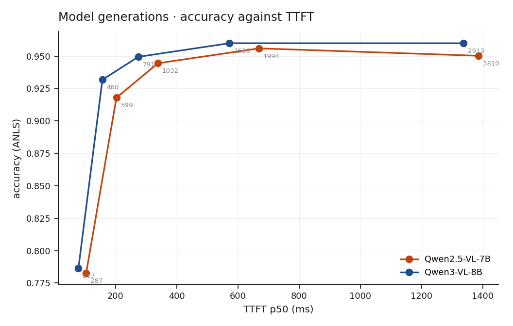

# Qwen2.5-VL-7B vs Qwen3-VL-8B

Same stack (vLLM v0.29.0), same harness, same prompts, same client-side token
budget, same datasets. Both 4-bit with the vision tower left unquantised. Only the
checkpoint changes.

## What the architecture predicted

| | Qwen2.5-VL-7B | Qwen3-VL-8B |
|---|---|---|
| vision tower | 1.353 GB | 1.153 GB |
| LLM, re-read every decode step | 5.571 GB | **6.397 GB** |
| decode ceiling (936 GB/s ÷ LLM) | 168.0 tok/s | **146.3 tok/s** |
| layers × KV heads | 28 × 4 | **36 × 8** |
| KV per token | 56.0 KB | **144.0 KB** |
| KV cache at util 0.90 | 213,456 tokens | **77,184 tokens** |

Both sides computed exactly from safetensors headers
([`tools/weight_split.py`](https://github.com/sadbodhs/vlm_inference_optimization/blob/main/tools/weight_split.py)),
not estimated.

## What was measured

| | Qwen2.5-VL-7B | Qwen3-VL-8B |
|---|---|---|
| decode | **149.02 ± 0.16** tok/s (88.7% of ceiling) | 125.81 ± 0.05 (86.0%) |
| TTFT law | 17.3 ms + 325 ms/1k | **6.3 ms** + 361 ms/1k |
| raw capacity | 1.56 req/s | **1.78 req/s** |
| usable goodput @ SLO | 0.45 req/s | **0.71 req/s** |
| ANLS @ 1,994 tokens | 0.956 | **0.960** |
| TTFT @ 1,994 tokens | 669 ms | **572 ms** |

**Qwen3-VL-8B is 16% slower at single-stream decode and better at everything else**
— faster TTFT at every budget, 58% more usable capacity, and slightly higher
accuracy at all five token budgets.

The decode result is structural and was predicted correctly: a larger LLM half
means a lower bandwidth ceiling, and 125.8 tok/s is 86% of *its own* 146.3.

{ width="600" }

## The prediction that was wrong

From 2.6× the KV per token and 2.8× less KV cache, the obvious conclusion was that
Qwen3 would serve **roughly half** the concurrent requests. It serves **58% more**.

The KV numbers were right. The inference from them was not: **KV was never the
binding constraint.** At ~2,000 vision tokens per request and ~1.8 req/s, only a
couple of requests are in flight at saturation, so the server runs out of *prefill
compute* long before it runs out of KV. A 77k-token cache is ~38 concurrent
document requests — far more than the workload ever asks for.

!!! note "Where this matters"
    A KV-capacity argument only binds when concurrency is high enough to consume
    it. For long-context or high-concurrency serving the 2.6× would dominate; for
    document extraction at these rates it is irrelevant. The same architecture
    difference is decisive or meaningless depending on the workload.

## Accuracy across the frontier

| vision tokens | Qwen2.5-VL-7B | Qwen3-VL-8B | Δ |
|---|---|---|---|
| 287 | 0.783 | 0.786 | +0.004 |
| 599 | 0.918 | **0.932** | +0.014 |
| 1,032 | 0.944 | 0.949 | +0.005 |
| 1,994 | 0.956 | 0.960 | +0.004 |
| 3,810 | 0.950 | 0.960 | +0.010 |

Both saturate in the same place — around 1,000 vision tokens — so the
[token-budget finding](e3-token-budget.md) holds across a model generation. Qwen3
is slightly ahead throughout, and reaches 0.932 at 599 tokens where Qwen2.5 needs
~1,000 for the same score.

!!! warning "An anomaly worth explaining before relying on it"
    Qwen3's E2 law, fitted on synthetic images at R²=0.997, predicts 726 ms at
    1,994 tokens. Real documents measured **572 ms** — a 21% over-prediction,
    larger than Qwen2.5's 6–18%. The synthetic-image law transfers worse for this
    model, possibly because DeepStack's multi-level merging behaves differently on
    synthetic bar patterns than on real pages. Unexplained.

## Which to deploy

**Prefill-bound work** — document extraction, video frames, short answers: Qwen3,
on every axis measured here.

**Decode-bound work** — long reasoning outputs: Qwen2.5 is 16% faster per token,
and that is the term that dominates when outputs are long.

Every accuracy number in this study comes from ~6-token answers, so this study
measures the prefill-bound case. The decode-bound case is
[unmeasured](not-measured.md).
