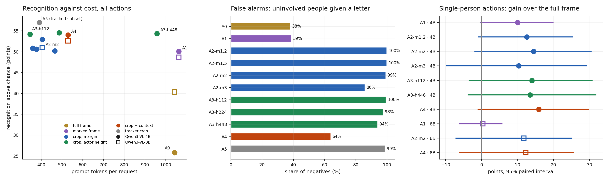

# R1 · The actor-crop reference level

**Question:** E7's ROI crop was one box around everyone in the frame, so it never
tested a clear view of the people acting. If the crop is centred on them instead,
at what margin and what size does a zero-shot VLM recognise the action best? And
does that beat the full frame?

**Answer:**

- **On the registered measure, six of seven predictions held.** An actor-centred
  crop doubles Qwen3-VL-4B's recognition above chance, **+53 vs +26 points**, at
  **39% of the tokens**. Qwen3-VL-8B gains +8 to +12.
- **Two things limit what that means.** The crop box was built from each
  activity's annotated participants, so its shape leaks who is involved. And crops
  make the model name an activity for **86–100% of uninvolved people**; the full
  frame does so for 38%.
- **Without the leak, on single-person actions, crops gain +12 to +16 points** on
  both models. Every 95% interval reaches just below zero, so the gain is likely
  but not established on 24 clips.
- **Margin and size barely matter.** Every margin from 1.2× to 3× lands within 3
  points, and an actor 112 px tall does as well as one 448 px tall. The cheapest
  actor crop works: **346 tokens, a third of the full frame**.
- **Crop plus a small full frame keeps most of the gain with the fewest false
  alarms of any crop**: 64% for the 4B and 60% for the 8B, against 99%.

!!! warning "Qualified by R1b"
    R1's crops were drawn around each activity's annotated participants. With the
    tracker choosing the crops and only gate-fired windows scored
    ([R1b](r1b-label-free.md)), most of the gain disappears: +9 points at best for
    the 4B, both intervals crossing zero, at about twice the false alarms, and −3 for
    the 8B.

Pre-registered in [RECIPE.md](https://github.com/sadbodhs/vlm_inference_optimization/blob/main/RECIPE.md)
before any request. Part of [Track B](recipe.md).

## Setup

- **Samples.** The 24 E7 clips. **488 positives**: every activity with a person
  actor, at the 2 s window around its midpoint (11 skipped for lacking a box on
  those frames). **465 negatives**: one tracked person per window, from windows with
  no labelled activity anywhere in the frame, so a letter is a false alarm under
  every arm, the full frame included. The 465 come from 13 clips; one camera
  supplies 150.
- **Scoring.** As in E7: *lift* is recognition minus chance, where chance comes
  from shuffling the arm's answers. A *false alarm* is any letter given for a
  negative. Arms are compared with a paired bootstrap over clips.
- **Arms.** Every arm sends the same two frames, one second apart:

    | arm | what the VLM sees |
    |---|---|
    | A0 | the full frame |
    | A1 | the full frame with a red box around the actors |
    | A2 | the actors' box expanded 1.2× / 1.5× / 2× / 3×, at native resolution |
    | A3 | the 2× crop resized so the actors are 112 / 224 / 448 px tall |
    | A4 | the 2× crop plus the full frame at ≤ 112,896 px, in one request |
    | A5 | the 2× crop from tracker boxes instead of annotated ones |

- **"Native" has a floor.** Qwen3-VL's own processor enlarges any image under 65,536
  px, which is 64 tokens. So a crop request costs at least ~330 tokens: two images
  plus the ~200-token question.
- **Models.** Qwen3-VL-4B on all eleven arms; Qwen3-VL-8B on four. vLLM was alone on
  the card; 17,000 requests, none failed.

## Results

| arm | 4B lift | 4B vs full frame [95%] | 4B false alarms | tokens | 8B lift | 8B vs full frame [95%] |
|---|---|---|---|---|---|---|
| A0 full frame | +25.8 | — | 38% | 1,042 | +40.3 | — |
| A1 marked frame | +50.1 | +24.3 [+11.0, +32.2] | 39% | 1,063 | +48.7 | +8.4 [+2.6, +13.2] |
| A2 crop 1.2× | +50.9 | +25.1 [+6.1, +34.9] | 100% | 359 | | |
| A2 crop 1.5× | +50.6 | +24.8 [+3.9, +36.0] | 100% | 378 | | |
| **A2 crop 2×** | **+53.0** | +27.2 [+6.5, +38.0] | 99% | 405 | +51.1 | +10.7 [−1.0, +21.5] |
| A2 crop 3× | +50.2 | +24.4 [+1.9, +36.1] | 86% | 466 | | |
| A3 actor 112 px | +54.2 | +28.4 [+5.3, +39.2] | 100% | **346** | | |
| A3 actor 224 px | +54.5 | +28.7 [+6.7, +38.6] | 98% | 486 | | |
| A3 actor 448 px | +54.4 | +28.6 [+4.7, +40.2] | 94% | 958 | | |
| **A4 crop + context** | +54.0 | +28.3 [+9.7, +39.9] | **64%** | 529 | **+52.6** | +12.3 [+1.1, +22.9] |
| A5 tracker crop ¹ | +57.0 | +25.1 [+3.1, +36.0] | 99% | 390 | | |

¹ Scored on the 275 positives the tracker matched. On those samples it is within
+0.2 points [−2.8, +3.5] of the annotated-box crop.

## Two things the headline hides

### The box leaks who is involved

Each positive's crop, and A1's red box, was drawn around **that activity's
annotated participants**: a person and the car they get into, or both people in a
conversation. Negatives are always one person. So the box's shape alone says
"there is a car here" or "two people", which is most of the answer. Split by what
the activity involves:

| Qwen3-VL-4B, lift | full frame | marked frame | crop 2× | crop + context |
|---|---|---|---|---|
| one person (226) | +33.7 | +43.7 | +48.2 | +49.6 |
| two or more people (187) | +8.2 | +45.7 | +55.4 | +50.5 |
| person + vehicle (75) | +38.8 | **+78.1** | +29.8 | +53.4 |

The jumps on multi-person and person-plus-vehicle activities are likely mostly the leak.
**Single-person activities cannot leak** that way, since positives and negatives are
both one person. That comparison is the clean one:

| single-person actions | Qwen3-VL-4B vs full frame [95%] | Qwen3-VL-8B vs full frame [95%] |
|---|---|---|
| marked frame | +10.0 [−0.3, +19.9] | +0.3 [−6.1, +5.6] |
| crop 2× | +14.4 [−1.8, +30.4] | +11.7 [−7.1, +25.0] |
| actor 112 px | +14.0 [−3.4, +30.7] | |
| crop + context | +15.9 [−1.0, +29.7] | +12.3 [−6.1, +25.5] |

The gain from seeing the actor clearly is **+12 to +16 points on both models**.
That's consistent, but every interval reaches just below zero.

### Crops lose the ability to say "nothing"

For a tracked person doing nothing labelled, the full frame produces a letter 38%
of the time. Every crop does so **86–100%** of the time. Framed tightly on a person,
the model always finds an activity. Adding the full frame back (A4) brings this
down to 64% (4B) and 60% (8B) with no loss of recognition, the only crop arm that
does. In a cascade the gate decides *whether* something happened, so this matters:
a gate that fires on uninvolved people would turn each firing into a false alarm.

## Predictions: which held

| # | prediction (pre-registered) | measured (Qwen3-VL-4B) | verdict |
|---|---|---|---|
| R1.1 | lift peaks at 1.5× or 2×; 1.2× and 3× lower; the peak above the full frame | 2× +53.0; 1.2× +50.9, 3× +50.2; full +25.8 | **held**, but the margins sit within 3 points |
| R1.2 | lift rises 112 → 224 px and changes < 3 points 224 → 448 | +54.2 → +54.5 → +54.4 | **held** only by 0.3 points: the curve is flat from 112 px |
| R1.3 | the crop's gain is larger for actors < 100 px than ≥ 100 px | +35.7 vs +13.3 (2× crop, all activities) | **held** |
| R1.4 | on vehicle and doorway activities, crop + context ≥ crop | +54.0 vs +50.6 | **held**, within noise |
| R1.5 | marked frame ≥ full frame, at < 5% more tokens | +24.3 [+11.0, +32.2], +2% tokens | **held**, largely the leak (single-person: +10.0) |
| R1.6 | the 2× crop costs ≤ 50% of the full frame's tokens | 39% | **held** |
| R1.7 | the tracker matches the actors in ≥ 60% of positives, and loses ≤ 5 points | 56%; −0.2 points on the matched ones | **failed** on coverage; the second half held |

**Against the literature.** [Context-Aware RCNN](https://arxiv.org/abs/2007.09861)
found the margin mattered little: 24.1 to 25.0 mAP from 1.2× to 2.5×, peaking at
1.5–2×. That matches R1. It also found resolution mattered: 112 px cost 3.6 mAP
against 224. R1 finds nothing between 112 and 448 px. That model was trained on
crops; a zero-shot VLM, with its processor's 65,536 px floor, is not.

## Caveats

- **24 clips.** Differences under ~10 points are not separable; the intervals say
  so row by row.
- **The crop boxes are ideal ones.** They come from annotated participants (A0–A4) or
  from tracker boxes matched to them (A5), and choose the right people for free. A
  deployment has to choose them without labels.
- **Negatives are quiet windows** from 13 of the 24 clips. They satisfy the
  registered rule (they overlap no annotated actor), which allowed windows with
  activity elsewhere in the frame; this sample is stricter.
- **Offline.** No cameras-per-GPU number yet; the 2× crop's token cost (39%)
  suggests the ceiling, which the detector reaches first at ~18 cameras
  ([E7d](e7d-models.md)).

## Next: R1b

Done: [R1b](r1b-label-free.md) chose crops from the tracker alone and scored the
gate's windows. Most of the gain did not survive.
