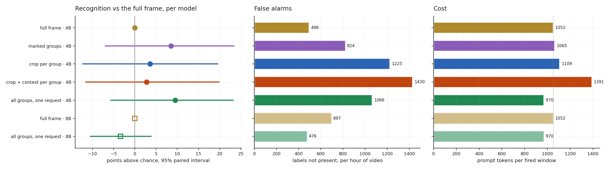

# R1b · Label-free crops, scored the way the cascade runs

**Question:** [R1](r1-actor-crops.md) found that an actor-centred crop doubles
recognition, but its crops were drawn around each activity's *annotated*
participants, which leaked who was involved. Here the **tracker alone** chooses the
crops (proximity groups of tracked people), and only the windows E7c's gate actually
fires are scored. Does centring on people still beat the full frame?

**Answer: mostly not.** R1's gain came largely from knowing whom to crop.

- **Qwen3-VL-4B:** the best label-free arms gain **+9 points** over the full frame:
  every group's crop in one request (+9.5), or boxes drawn on the full frame (+8.6).
  Both intervals cross zero, and both come with **1.7–2.1× the false alarms**.
- **Qwen3-VL-8B gets worse with crops**: −3.4 points [−10.5, +3.8], though with a
  third fewer false alarms (476 vs 697 per hour).
- **Adding context no longer helps.** In R1 it cut false alarms from 99% to 64%.
  Here, crop + context per group raises them to **2.9×** the full frame's.
- **Separate crop requests cost more than the full frame.** Each request repeats
  the ~200-token question, so one request per group costs 1,109–1,391 tokens per
  window against 1,052. Only putting every group in one request is cheaper: **970**.
- **1 of 5 predictions held.**

The strongest option on this data is the one that crops nothing: **Qwen3-VL-8B on
the full frame**, which gets +22.6 points above chance at 697 false alarms per hour.

Pre-registered in [RECIPE.md](https://github.com/sadbodhs/vlm_inference_optimization/blob/main/RECIPE.md)
before any request. Part of [Track B](recipe.md).

## Setup

- **The unit is the gate-fired window.** E7c's `track-motion` gate fires on
  **1,531 of 3,600** windows (42.5%). Non-fired windows answer nothing in every arm,
  as in a live cascade.
- **Crops come from the tracker alone.** People tracked on the two VLM frames are
  grouped by proximity: a gap of at most one body height, and a vehicle joins the
  nearest person within one body height. Each group is cropped at 2× its box. Fired
  windows hold **2.2 groups** on average (p90 5). Windows with no group fall back to
  the full frame. Without any labels, these crops contain an actor of **86%** of the
  person activities in fired windows.
- **Arms:**

    | arm | per fired window |
    |---|---|
    | F | the full frame, E7's prompt |
    | M | the full frame with every group's crop drawn in red |
    | GS | one request per group: the group's 2× crop |
    | GSC | one request per group: the crop plus a low-resolution full frame |
    | GO | one request: every group's crop plus one low-resolution full frame |

- **Scoring, as E7:** per activity instance, over all 2 h of video. An activity is
  recognised if its group letter appears for any fired window it overlaps. Chance
  comes from shuffling window answers across fired windows. A false alarm is any
  letter absent from the window's labels.

## Results

| arm | 4B lift | vs full frame [95%] | recognised / chance | false alarms / h | tokens / window |
|---|---|---|---|---|---|
| F full frame | +11.8 | — | 43.7 / 31.9 | 496 | 1,052 |
| M marked groups | +20.4 | +8.6 [−6.9, +23.3] | 69.7 / 49.4 | 824 | 1,065 |
| GS crop per group | +15.4 | +3.6 [−12.3, +19.5] | 72.8 / 57.4 | 1,225 | 1,109 |
| GSC crop + context per group | +14.6 | +2.8 [−11.6, +19.9] | 76.4 / 61.8 | 1,430 | 1,391 |
| **GO all groups, one request** | **+21.3** | +9.5 [−5.6, +23.1] | 70.4 / 49.1 | 1,066 | **970** |
| **8B** F full frame | **+22.6** | — | 71.3 / 48.6 | 697 | 1,052 |
| 8B GO | +19.3 | −3.4 [−10.5, +3.8] | 61.4 / 42.1 | **476** | 970 |

**Crops buy recognition by saying more.** Raw recognition rises from 44% to
70–76%, but chance rises almost as far, from 32% to 49–62%. Shown people up
close, the model names more activities, right ones and wrong ones alike. What
survives chance correction is +3 to +10 points, all inside the noise.

**Why R1 looked better.** R1 cropped exactly the annotated participants, and scored
negatives from quiet windows. Here the crop holds whoever the tracker grouped:
bystanders, partial groups, or nobody relevant (the groups miss 14% of person
activities). The comparison runs on the gate's windows, which lean busy.

## Predictions: which held

| # | prediction (pre-registered) | measured | verdict |
|---|---|---|---|
| R1b.1 | crop + context per group beats the full frame by ≥ 5 points | +2.8 [−11.6, +19.9] | **failed** |
| R1b.2 | crops alone ≥ 2× the full frame's false alarms; crop + context ≤ 1.5× | 2.5×; **2.9×** | **failed**: context did not help |
| R1b.3 | one request per window within 5 points of per-group crop + context, at ≤ 60% of its tokens and ≤ the full frame's | +6.8 points **better**; 70% of its tokens; 92% of the full frame's | **failed**, in GO's favour on recognition |
| R1b.4 | marked frame ≥ full frame, false alarms within ±25%, < 5% more tokens | +8.6; **+66%** false alarms; +1.3% tokens | **failed** on false alarms |
| R1b.5 | the 8B gains less from one-request crops than the 4B | 4B +9.5, 8B −3.4 | **held** |

## What it means for the recipe

- **The crop is not a free lever.** Chosen by the pipeline rather than the
  annotation, actor crops add at most ~9 points of recognition for a small model, at
  roughly twice the false alarms, and nothing for a stronger one.
- **If you crop, send every group in one request.** Every group plus one
  low-resolution context frame costs 8% fewer tokens than the full frame and
  recognises best among the crop arms. Separate requests per group pay the question
  once per group.
- **The model beats the crop.** Moving from Qwen3-VL-4B to 8B on the full frame is
  worth +10.8 points above chance, more than any cropping arm on the 4B.
- **The remaining open question is precision, not recognition.** Every crop arm
  raises false alarms. A second pass that confirms a named activity, or a prompt
  that makes "nothing notable" easier to say, is the next lever. It enters the
  backlog.

## Caveats

- **24 clips, 1,531 fired windows.** Differences under ~10 points are not
  separable.
- **One grouping rule** (one body height) and one crop margin (2×, R1's best).
  Tighter or looser grouping is not measured.
- **Offline.** No live cameras-per-GPU for the crop arms. Their token costs (92–132%
  of the full frame) suggest no capacity gain.
