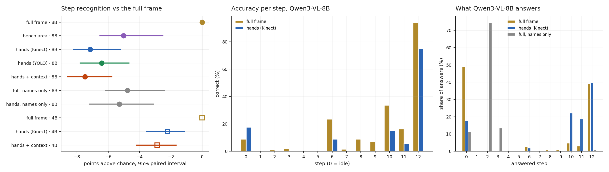
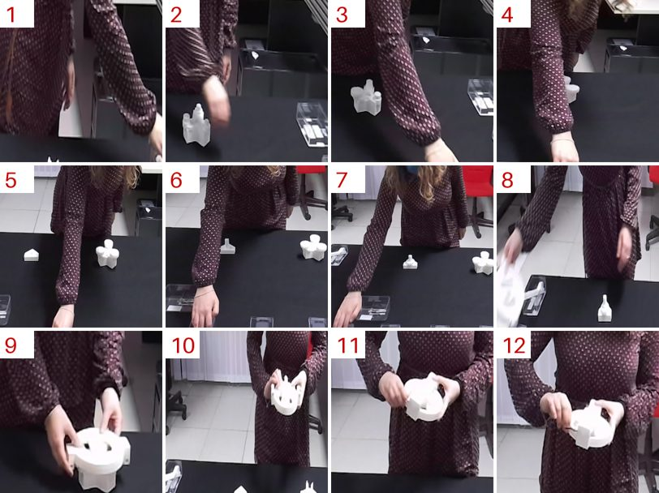

# R2 · Manufacturing: hand crops on an assembly task

**Question:** [R1](r1-actor-crops.md) and [R1b](r1b-label-free.md) tested crops on
surveillance video, where people are small and most actions are body-scale. Theory
says crops pay when the answer lies in **detail the full frame shrinks away**. In
the HA4M assembly dataset, a worker at a fixed station builds a planetary gear set
in 12 steps, and most steps differ only by **which small part is in the hand**. Do
label-free hand crops beat the full frame there?

**Answer: no. The model cannot do this task at any resolution.**

- **Hand crops are worse than the full frame, and this time the interval is
  tight:** Qwen3-VL-8B loses **−7.2 points [−8.2, −5.2]** with Kinect hand crops,
  −6.4 with YOLO hand crops and −7.5 with crop + context. A fixed bench area loses
  −5.0. Qwen3-VL-4B loses −2 to −3.
- **The reason is a floor, not the crop.** Even on the full frame, Qwen3-VL-8B is
  right **14.5%** of the time (chance 5.8%). Its answers collapse onto "no step"
  (49%) and step 12 (39%). **Steps 1–5 and 7 are almost never recognised** (0–2%),
  with or without a crop. It recognises only steps with coarse, whole-scene cues:
  turning the screws on the finished assembly (94%), placing the cover (34%) and the
  sun gear (24%).
- **So the crop removes the only cues the model uses** (how far the assembly has
  got, where the arms are) and adds part detail it cannot use.
- **The reference sheet helps only a little:** +4.8 points on the full frame. With
  the step names alone, the model answers "step 2" 75% of the time.
- **3 of 9 predictions held**, and those three are the uninformative ones: the RGB
  hand finder matches the Kinect's, the crops' token cost, and the 4B losing less.

**For the recipe:** fine-grained, part-level assembly steps are beyond a zero-shot
8B VLM. The crop theory remains untested where it should apply, because the model
never got off the floor. That calls for a model trained on the task. A trained
action recogniser (R4) or a fine-tuned VLM is the next test, not a different crop.

Pre-registered in [RECIPE.md](https://github.com/sadbodhs/vlm_inference_optimization/blob/main/RECIPE.md)
before any request. Part of [Track B](recipe.md).

## Setup

- **Data: HA4M** (Cicirelli et al., *Scientific Data* 2022, CC BY 4.0). 217
  recordings, 41 workers, one fixed Azure Kinect, 2048 × 1536 frames, every frame
  labelled with its step. Only the frames used were downloaded (15.6 GB of a 4.6 TB
  share), and they were deleted after the run.
- **Two camera setups:** a lab where parts sit in clear boxes (22 workers) and a
  white room where they lie loose and the worker stands further back (19 workers).
  One worker per setup was held out to make that setup's **reference sheet**
  (below). **2,570 samples** were scored: two frames one second apart around the
  middle of each step, and of the final idle stretch.
- **Crops, all label-free, at native resolution:**
  - Hand crops cover **2.8% of the frame**, so parts appear **2.6× larger** than in
    the full frame. They come from the camera's own body tracking (Kinect) or from
    YOLOv8s-pose (RGB only), which found the worker in all 5,844 frames; the two
    crops overlap at a median IoU of 0.78.
  - The **bench area** is a fixed box per setup.
- **Every request** carries the reference sheet first, unless marked "names only",
  and asks for the step number (0 = none).

{ width="560" }

*Reference sheet for the lab setup, built from the held-out worker's hand crops.
A single mid-step frame often does not show the part (step 1 is mostly an arm).
That is one limit of the test. HA4M frames © Cicirelli et al., CC BY 4.0.*

## Results

| Qwen3-VL-8B | accuracy | chance | lift | vs full frame [95%] | tokens |
|---|---|---|---|---|---|
| **full frame** | **14.5%** | 5.8% | **+8.7** | — | 1,543 |
| bench area | 9.8% | 6.1% | +3.7 | −5.0 [−6.5, −2.5] | 997 |
| hands (Kinect) | 8.6% | 7.0% | +1.5 | −7.2 [−8.2, −5.2] | 908 |
| hands (YOLO) | 9.0% | 6.8% | +2.3 | −6.4 [−7.8, −4.7] | 950 |
| hands + context | 8.6% | 7.4% | +1.2 | −7.5 [−8.6, −5.8] | 1,025 |
| full frame, names only | 14.0% | 10.1% | +3.9 | −4.8 [−6.2, −2.4] | 1,080 |
| hands, names only | 12.9% | 9.5% | +3.4 | −5.3 [−7.2, −3.1] | 445 |

Qwen3-VL-4B: full frame +3.3, hands −2.2 [−3.6, −1.2], hands + context −2.9
[−4.2, −1.7].

**Where it fails.** Every arm is worse than the full frame on part steps (1–8, 10,
11), in the lab and in the white room alike. Hand crops lose most in the white room
(−8.2), where parts are smallest in the frame. That is the opposite of the theory,
and consistent with the model relying on context rather than detail.

## Predictions: which held

| # | prediction (pre-registered) | measured (8B) | verdict |
|---|---|---|---|
| R2.1 | hand crops beat the full frame by ≥ 5 points | −7.2 [−8.2, −5.2] | **failed** |
| R2.2 | the YOLO hand crop is within 5 points of the Kinect one | +0.7 | **held** |
| R2.3 | the crop gains more on part steps than on steps 9 and 12 | −8.3 vs +0.6 | **failed** |
| R2.4 | the crop gains more in the white room than in the lab | −8.2 vs −5.3 | **failed** |
| R2.5 | the bench area gains less than hand crops | −5.0 vs −7.2 | **failed** |
| R2.6 | crop + context ≥ crop | −0.3 | **failed**, within noise |
| R2.7 | the reference sheet adds ≥ 10 points on the full frame and on hands | +4.8, −1.9 | **failed** |
| R2.8 | hand crops cost ≤ 70% of the full frame's tokens | 59% | **held** |
| R2.9 | the 4B gains more from hand crops than the 8B | −2.2 vs −7.2 | **held**, only in losing less |

## What R2 does and does not show

- **It shows** that a zero-shot 8B VLM cannot tell these assembly steps apart, and
  that cropping cannot fix a model that has no grip on the parts.
- **It does not show** that crops never help. A model that could recognise the
  parts might gain from seeing them larger; this experiment never met that
  condition.
- **For practice:** part-level industrial steps need a model trained on them, even
  when the camera is fixed and close. The zero-shot VLM belongs on questions with
  coarse cues, like whether the assembly is finished, whether the worker is at the
  station, or whether the cover is on.

## Caveats

- **The reference sheet is weak.** It is one mid-step frame per step, from one
  worker, and often does not show the part. A sheet of the parts themselves, or
  several examples per step, might lift the floor.
- **Two frames one second apart.** A pick-and-place step lasts 3–10 s; more frames
  (R6) might help the full frame and the crop alike.
- **One prompt, 8 answer tokens.**
- **Not measured:** a trained action recogniser (R4), fine-tuning, depth, live
  cameras.
