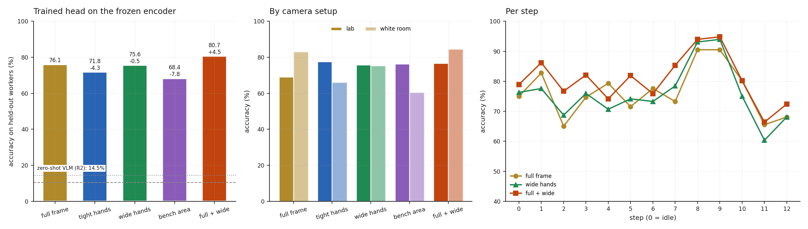

# R2b · Does the crop hold more information for a trained model?

**Question:** in [R2](r2-manufacturing.md), zero-shot Qwen3-VL-8B scored 14.5% on
the 12 assembly steps, and hand crops made it worse. That left two explanations.
**(A)** The image holds the information, but a model that doesn't know these
parts can't use it, so training would pay and crops might help. **(B)** The crop
throws away what identifies the step, so crops are wrong even for a trained model.
Before spending anything on fine-tuning, a probe on the **frozen** encoder separates
the two.

**Answer: (A), mostly.**

- **The information is in the image.** A small classifier trained on Qwen3-VL-8B's
  own frozen vision encoder names the step for **76.1%** of samples from workers it
  never saw, against **14.5%** for the zero-shot VLM and 10.4% for always
  guessing the commonest step. R2's failure was the model's ability to name what
  it saw, not its vision.
- **A crop alone matches the full frame; it doesn't beat it.** The wide hand crop
  (three shoulder widths) scores 75.6% (−0.5 [−6.8, +6.0]). The tight crop scores
  71.8% (−4.3 [−12.5, +4.1]) and the bench area 68.4% (−7.8 [−15.8, +0.4]).
- **Full frame plus wide crop together is the best: 80.7%, +4.5 points [+1.5,
  +7.5] over the full frame.** The crop adds detail the full frame lacks, and the
  full frame adds context the crop lacks. This is the one clear gain crops have
  shown in Track B.
- **It depends on the camera setup** (a breakdown, not a prediction). In the lab,
  crops beat the full frame (tight 77.6%, wide 75.9% vs 69.1%). In the white room,
  the full frame wins (83.0% vs 66.1% tight). Detail and context are both needed,
  in proportions that vary by station.
- **3 of 5 predictions held.** By the rule registered in advance, **fine-tuning a
  sub-1B VLM on crop plus full frame is justified**: full + wide beats the better
  single view with an interval above zero.

Pre-registered in [RECIPE.md](https://github.com/sadbodhs/vlm_inference_optimization/blob/main/RECIPE.md)
before any features were extracted. Part of [Track B](recipe.md).

## Setup

- **Data:** HA4M ([R2](r2-manufacturing.md)), a 20-worker subset re-downloaded for
  this probe: 10 lab workers and 10 white-room workers, **1,561 samples** (two frames
  1 s apart around each step's midpoint). Deleted again after the run.
- **Encoder:** Qwen3-VL-8B's vision tower (576M parameters), frozen, loaded alone.
  Each image's final tokens are averaged into one 4,096-number vector, and the two
  frames are averaged. Images are preprocessed as the VLM would (frames capped at
  451,584 px).
- **Views**, all label-free, from the Kinect's body tracking: the **full** frame; a
  **tight** hand crop (one shoulder width around each wrist, R2's, 2.9% of the
  frame); a **wide** crop (three shoulder widths: hands, upper body, workspace;
  13.9%); the **bench** area (2.9%); and **full + wide**, both vectors side by side.
  See the [R2 gallery](r2-manufacturing.md) for what these look like.
- **Head:** a logistic regression (a linear classifier) on standardised features,
  its regularisation chosen on held-out training workers. **5-fold cross-validation
  grouped by worker**: every prediction is for a worker the head never saw, with
  both setups in every fold. Views are compared by a paired bootstrap over workers.

## Results

| view | accuracy | macro-F1 | vs full frame [95%] | lab | white room |
|---|---|---|---|---|---|
| zero-shot VLM ([R2](r2-manufacturing.md), for scale) | 14.5% | — | — | — | — |
| **full frame** | **76.1%** | 76.2 | — | 69.1% | **83.0%** |
| tight hands | 71.8% | 72.0 | −4.3 [−12.5, +4.1] | **77.6%** | 66.1% |
| wide hands | 75.6% | 75.7 | −0.5 [−6.8, +6.0] | 75.9% | 75.3% |
| bench area | 68.4% | 68.6 | −7.8 [−15.8, +0.4] | 76.3% | 60.5% |
| **full + wide** | **80.7%** | **80.6** | **+4.5 [+1.5, +7.5]** | 76.7% | **84.6%** |

**Where full + wide helps.** It gains most on steps 2 (gear bearings, +12), 7
(sun gear bearing, +12), 5 (sun shaft, +10) and 3 (planet gears, +7). These are
small parts that look alike, which is the case the crop theory is about.

## Predictions: which held

| # | prediction (pre-registered) | measured | verdict |
|---|---|---|---|
| R2b.1 | the full-frame probe reaches ≥ 40% | 76.1% | **held** |
| R2b.2 | wide ≥ full + 3 points | −0.5 [−6.8, +6.0] | **failed** |
| R2b.3 | wide ≥ tight | +3.8 | **held** |
| R2b.4 | full + wide ≥ the better single view + 2 | +4.5 [+1.5, +7.5] over full | **held** |
| R2b.5 | wide's gain over full is larger on part steps than on 9 and 12 | −1.0 vs +1.7 | **failed** |

**The decision, as registered:** fine-tune a sub-1B VLM on crops only if R2b.2 or
R2b.4 held with an interval above zero. R2b.4 did. The next step on this thread is
fine-tuning a small VLM on the full frame plus the wide crop, in the backlog.

## What it means

- **R2 was a naming problem, not a vision problem.** The frozen encoder carries
  enough to name the step three times out of four. The zero-shot language side
  cannot connect "sun gear bearing" to what it sees. Training fixes that; a bigger
  crop does not.
- **Crops help as extra input, not as a replacement.** Both views together beat
  either alone, as with [ViCrop](https://arxiv.org/abs/2502.17422) (crop added
  alongside the full image) and Context-Aware RCNN (actor features plus scene
  features). Replacing the full frame with a crop lost ground in every Track B
  experiment.
- **Which view matters depends on the station.** The lab camera favoured crops, the
  white room the full frame. One fixed crop rule will not be right everywhere.

## Caveats

- **A linear probe on averaged features.** Averaging over all tokens dilutes a
  small region in a large frame, which may understate the full frame (and flatter
  crops). An attention-pooled head, as in the planned encoder-head work, would
  treat views more evenly.
- **20 workers, one dataset, one encoder.** The intervals are wide; the per-setup
  numbers carry no intervals and ten workers each.
- **Two frames, and no temporal model.** A pick-and-place step lasts 3–10 s.
- **Not measured:** fine-tuning; other encoders; the YOLO hand finder (within 0.7
  points of the Kinect's in R2).
