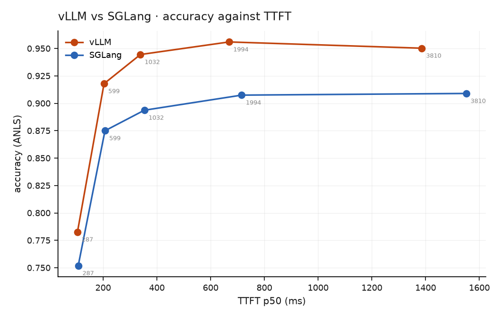
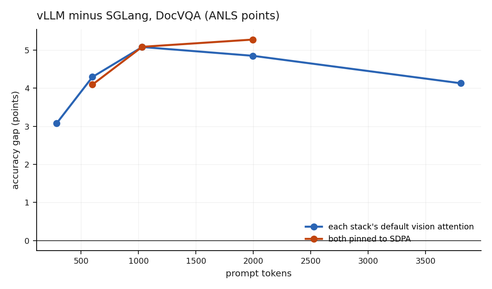

# vLLM vs SGLang

Same model, same weights snapshot (`536a3579`), same quantisation (`awq_marlin`),
same client-resized images — verified to produce prompt token counts matching **to
the decimal** on both engines (287.2 / 598.7 / 1032.3 / 1994.2 / 3809.6).

Both vendors' default-on optimisations disabled on both sides: prefix/radix
caching, chunked prefill, multimodal caching. KV capacity matched to within 0.14%
(213,746 vs 213,456 tokens).

## Speed — SGLang wins, conditionally

| | vLLM v0.29.0 | SGLang v0.5.20 |
|---|---|---|
| decode | 149.05 ± 0.08 tok/s | **152.62 ± 0.07** (+2.4%) |
| TTFT p50 | 46.1 ms | **34.9 ms** (−24%) |
| usable goodput (TTFT ≤ 1 s) | **0.45 req/s** | 0.35 req/s (−22%) |
| raw ceiling | 1.56 req/s | not measured — see below |
| cold start (CUDA graphs) | **4 s** | 125 s |

!!! danger "Corrected: SGLang's capacity was not +22%"
    This table previously gave SGLang **0.55 req/s** of usable goodput, 22% *above*
    vLLM. That number came from the 2.0 req/s rate, where **34 of 80 requests
    returned HTTP 500**. Latency and goodput were computed over the survivors, so
    losing 43% of the requests made that rate look like SGLang's best. Every SGLang
    rate at or above 1.5 req/s had failures (4%, 43%, 21%), so its saturated
    capacity is **not measured**; the valid rates put its usable goodput at 0.35
    req/s. The harness now disqualifies any rate with more than 1% failed requests.
    See [corrections](corrections.md).


The TTFT laws **cross** rather than one dominating:

```
vLLM    17.3 ms + 325 ms/1k tokens     ← lower slope
SGLang   4.5 ms + 354 ms/1k tokens     ← lower floor
```

A 4× lower fixed floor against a 9% steeper slope puts the crossover near **440
vision tokens**. SGLang wins on small images, vLLM on large ones — at the largest
budget vLLM is faster outright, 1,386 ms vs 1,551 ms. A single "which is faster"
answer would be wrong.

## Cost — SGLang scores 3–5 ANLS points lower

{ width="600" }

| vision tokens | vLLM | SGLang | gap |
|---|---|---|---|
| 287 | 0.783 | 0.752 | +0.031 |
| 599 | 0.918 | 0.875 | +0.043 |
| 1,032 | 0.944 | 0.894 | +0.051 |
| 1,994 | 0.956 | 0.907 | +0.049 |
| 3,810 | 0.950 | 0.909 | +0.041 |

Inputs are identical and decoding is greedy. **74.4% of outputs match byte for
byte**; the 25.6% that differ show SGLang generating ~9% fewer tokens — `'43%'`
becomes `'43'`, `'Reynolds Tobacco Co.'` becomes `'Reynolds Tobacco'`.

Ruled out as a harness artefact: streamed and non-streamed output from the same
server match on 12/12 samples, so the client is not dropping a final token.

!!! failure "Tested, and the hypothesis was wrong"
    The gap **tracks vision-token count** (0.031 → 0.043 → 0.051), which is the
    shape of numerical divergence accumulating in the vision tower. SGLang defaults
    to `triton_attn` there while vLLM does not, so the obvious explanation was a
    different vision attention kernel.

    Both stacks were pinned to the one backend they share — vLLM `TORCH_SDPA`,
    SGLang `sdpa`, each verified in the server's own startup log — and E3 re-run at
    n=500:

    | budget | vLLM-SDPA | SGLang-SDPA | gap | *(gap before)* |
    |---|---|---|---|---|
    | 451,584 | 0.911 | 0.870 | **0.041** | *0.043* |
    | 802,816 | 0.944 | 0.893 | **0.051** | *0.050* |
    | 1,605,632 | 0.957 | 0.904 | **0.053** | *0.049* |

    **Unchanged.** The vision attention kernel is not the cause.

{ width="600" }

*The two lines are the same gap measured twice — once with each stack's default
vision attention, once with both pinned to SDPA. If the kernel were the cause, the
second line would sit at zero.*

### What is ruled out

- **Inputs** — prompt token counts match to the decimal, so tokenisation and the
  chat template are identical.
- **Weights** — same snapshot, loaded from the same cache.
- **Sampling** — greedy on both; 74.4% of outputs match byte for byte.
- **The harness** — streamed and non-streamed output from one server match 12/12.
- **Vision attention kernel** — pinned to SDPA on both, gap unchanged.

What remains: numerical differences elsewhere in the forward pass — the 4-bit
dequantisation kernel, RoPE/mRoPE for vision positions, normalisation, or the
projector. **Unresolved.**

### A side finding worth more than the test

Forcing SDPA costs speed, and costs SGLang far more:

| budget | vLLM default → SDPA | SGLang `triton_attn` → SDPA |
|---|---|---|
| 451,584 | +6% TTFT | **+19%** |
| 802,816 | +6% | **+34%** |
| 1,605,632 | +7% | **+66%** |

Accuracy moved by ≤0.005 in both cases. So SGLang's `triton_attn` default is a
**real optimisation — up to 66% faster TTFT at no measurable accuracy cost** — and
not the quality compromise this test was built to expose.

**The honest headline: SGLang is 2.4% faster at decode and 24% faster to first
token, and 4–5 ANLS points less accurate on DocVQA with every variable we can
control held identical.** The cause is unknown, and the most plausible explanation
has been tested and refuted. Publishing the speed half alone would be the failure
R3 exists to prevent.
