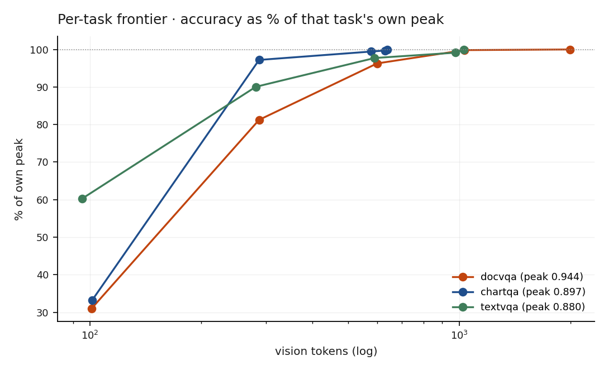

# The per-task frontier

**Question:** does "how many vision tokens do I need" have one answer, or one per
task?

The same budget sweep on three tasks, each scored with its own official metric —
ANLS, relaxed accuracy, exact match. Absolute scores are therefore **not comparable
across columns**; only the shape of each curve is. 400 samples per point.

| budget | tokens | DocVQA | ChartQA | TextVQA |
|---|---|---|---|---|
| 50,176 | 101 | 0.293 | 0.297 | **0.530** |
| 200,704 | 287 | 0.767 | **0.873** | 0.792 |
| 451,584 | 600 | 0.909 | 0.892 | 0.860 |
| 802,816 | 1,034 | 0.943 | 0.895 | 0.873 |
| 1,605,632 | 1,999 | 0.944 | 0.897 | 0.880 |

{ width="620" }

Each curve is normalised to its **own** peak, because the three metrics are not
comparable in absolute terms — only the shape is.

## Saturation is task-dependent

| task | saturates at | peak |
|---|---|---|
| **ChartQA** | **577 tokens** (202 ms) | 0.897 |
| TextVQA | 977 tokens (334 ms) | 0.880 |
| DocVQA | 1,034 tokens (339 ms) | 0.944 |

Fraction of each task's **own peak** retained at 287 tokens, bootstrapped:

| task | retained | 95% CI |
|---|---|---|
| ChartQA | **97.2%** | [93.6, 100.8] |
| TextVQA | 90.1% | [85.5, 94.6] |
| DocVQA | **81.3%** | [77.3, 85.1] |

DocVQA and ChartQA do not overlap. **The answer is task-dependent** — charts reach
their ceiling at roughly half the token budget documents need.

## The prediction was wrong, and the correction is more useful

The hypothesis was a document-to-natural-image gradient: DocVQA most demanding,
ChartQA in the middle, TextVQA cheapest. The measured order is
**ChartQA cheapest, TextVQA middle, DocVQA most demanding.**

TextVQA is *text in natural scenes* — still a reading task, so it still needs
resolution to resolve glyphs. Choosing it as the "natural image" arm was a category
error: it tests reading in the wild, not appearance.

What actually governs the budget is **the angular size of the smallest feature that
carries the answer**:

- **charts** — bars, lines, axis labels: large marks, survive downscaling
- **scene text** — signs and labels: mid-sized
- **document text** — dense small glyphs: the most demanding

That is a better rule than "documents versus natural images", because it predicts
the budget from the *content* rather than the dataset's name.

## One exception at the extreme

At 101 tokens every task collapses — except TextVQA, which retains **60.2%
[54.8, 65.9]** of peak against ~31% for the other two.

At that resolution no text is legible anywhere. TextVQA questions still score
because many are answerable from scene context alone ("what colour is the bus?"),
while DocVQA and ChartQA questions have no non-textual fallback. The floor is set
by how much of the task survives when reading becomes impossible.

!!! warning "What this still does not measure"
    All three tasks require reading something. A VQA task with **no text at all**
    (VQAv2-style) is untested, so the claim that pure appearance questions tolerate
    aggressive pruning remains unmeasured — it was the original hypothesis, and the
    dataset chosen to test it turned out to test something else.
